# Acorn File Forge

Acorn File Forge is a web and native Linux workshop for Acorn disk, hard-drive,
tape and ROM images. It covers BBC Micro, BBC Master, Electron, Archimedes and
compatible RISC OS media. Both editions use the same workbench, filesystem
services and editors, so a format fix or feature is not maintained twice.

Open as many image panes as the browser and computer can comfortably handle,
browse their real filing systems and drag files between them. You can add,
export, rename, move, delete, lock, compact and validate files without touching
the original image on your computer. MMB and ADFS menu tools, private session
recovery, undo points, health checks and format-aware imports are part of the
same workflow.

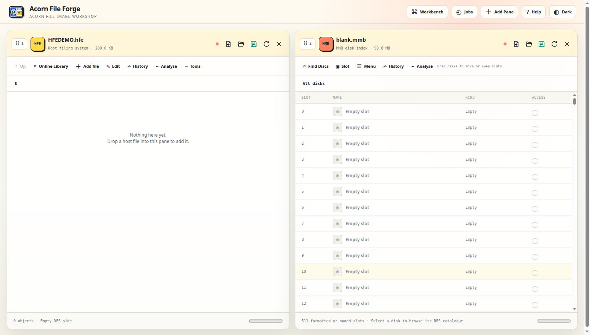

The light palette takes its cues from a BBC Model B: warm case beige, charcoal
key legends, muted green, ochre and function-key red. Dark mode keeps those
relationships with a complementary, phosphor-friendly palette.

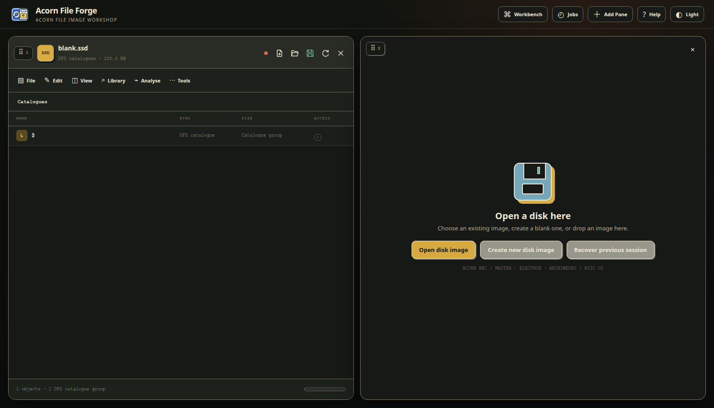

## Accessibility and themes

The frontend targets WCAG 2.2 AA in light and dark mode. It provides a skip
link, clear keyboard focus, labelled controls and image tables, focus-contained
dialogs, screen-reader status announcements, non-colour state cues and reduced
motion support. The layout remains usable with browser zoom and at narrow
viewport widths. Drag operations have keyboard alternatives: Cut, Copy and
Paste handle files and MMB slots, while Alt+Left and Alt+Right on a pane grip
reorders panes.

The operating-system colour preference is used on first visit. The Light / Dark
button in the header stores the chosen mode in the current host's private
state. Theme colours live
in `app/static/theme.css` as semantic custom properties. Layout, typography and
component geometry live separately in `app/static/styles.css`, so another
palette can be introduced without rewriting the interface. Any new palette
should keep normal text at 4.5:1 or better, large text and meaningful graphics
at 3:1 or better, and a clearly visible keyboard focus indicator.

## Quick start

The source lives at
[github.com/peteclarke-del/AcornFileForge](https://github.com/peteclarke-del/AcornFileForge).
Clone it over HTTPS and start the Docker service:

```bash
git clone https://github.com/peteclarke-del/AcornFileForge.git
cd AcornFileForge
docker compose up --build -d
```

SSH cloning also works when your GitHub public key is configured, but it is not
required to install or run the application.

Open <http://localhost:8666>.

Linux users can instead install the GTK 4 desktop host. GTK and Libadwaita
provide the window decorations, application menu, symbolic icons and local
file chooser, while managed emulators use native windows. The shared workbench
inherits the desktop font and colour preference. Large local images use a
filesystem clone or one sparse working copy rather than a browser upload:

```bash
tools/install-linux-desktop.sh
tools/acorn-file-forge-desktop
```

Release builds also provide a native-architecture Debian package. Install it
on the Debian or Ubuntu release for which it was built:

```bash
sudo apt install ./acorn-file-forge_VERSION_ARCH.deb
acorn-file-forge
```

The package installs the application under `/opt/acorn-file-forge`, registers
the launcher, icon, MIME types, AppStream record and manual page, and vendors
the pinned Python packages. It does not bundle Acorn firmware or commercial
media. Build a package for the current machine with
`tools/build-linux-package.sh`; build the complete clean-tree release set with
`tools/build-release.sh`.

The native chooser accepts several images at once. Supported images can also
be dragged from the Linux file manager onto a pane. Matching DAT and DSC files
are paired before opening, and both paths use the fast private local-file
adapter rather than uploading bytes through WebKit. A review step applies the
active hardware profile, permits an explicit ADFS target and distinguishes
separate ROM images from linear or byte-interleaved physical ROM sets. Native
opens are serialised, while a stable private owner and XDG-backed client state
retain sessions, workspace settings, profiles and the collection catalogue
across random-port desktop launches.

Read the [Linux desktop guide](docs/LINUX-DESKTOP.md) for prerequisite packages,
XDG storage, emulator paths and removal. The
[platform contract](docs/PLATFORM-CONTRACT.md) requires shared changes to be
implemented and tested for both web and desktop hosts.

If your system still uses the standalone Compose command, replace
`docker compose` with `docker-compose` in the examples below.

The service listens on port `8666`. Its working images are stored in the
`acorn-file-forge-work` Docker volume. Files selected in the browser are uploaded into
private working sessions; the application does not mount or alter the source
directory on the host.

To stop it:

```bash
docker compose down
```

To remove the saved working sessions as well:

```bash
docker compose down -v
```

Only use the second command when you really want to discard every working
copy.

The `samples/` directory is intentionally excluded from Git and from archives
made with `git archive`. Local test images can be large and may contain software
that is not ours to redistribute. Add your own fixtures there when developing;
they will not be committed or packaged.

## Current status

The current release candidate is `1.0.0-rc.2`. It provides the editing and
transfer workflows described in this guide, including movable, resizable and
stackable panes, undo and named checkpoints, owner-isolated recovery,
background job tracking, MMB and ADFS menu maintenance, HFE handling, an Online
Library and hardware-aware ADFS checks. UEF projects expose the physical chunk
layout and permit same-length member edits only when the recording can be
rebuilt without altering timing or unknown chunks. A host-private collection
catalogue retains owned-image manifests, hashes, menu titles, publishers,
machines and physical locations, then reports duplicates, variants and missing
wanted titles even when those images are closed. The web edition uses
origin-scoped IndexedDB. The Linux desktop edition stores the same bounded
state atomically in its private XDG configuration directory.

Raw and banked ROM analysis, editable Acorn ROMFS data images, content-aware
file editors, archive browsing, guarded BASIC transformations and annotated
6502, ARM and 68000 disassembly are included. Cheat analysis combines static
evidence with tester-supplied emulator observations; proven changes can be
packaged as exact-hash guarded patches and retained in the same host-private
state. Managed Elkulator, B-em and MAME sessions support the media each tool
can mount. Electron MMFS profiles can test a complete MMB through a generated
private FAT32 card and the Pi1MHz adapter. Recognised menu programs can also be
captured in the emulator sandbox for comparison with their decoded preview.

Acorn media can contain unusual loaders, copy protection and filesystem
variants. Keep a known-good source image and test important downloads before
putting them onto real hardware. The application reports uncertainty rather
than claiming that an unproved conversion or launch path is safe.

Bug reports and proposed improvements can be raised in the
[GitHub repository](https://github.com/peteclarke-del/AcornFileForge). Read the
[contribution guide](CONTRIBUTING.md) before submitting a change and report
suspected vulnerabilities through the private process in
[SECURITY.md](SECURITY.md), not a public issue.
The [product backlog](docs/BACKLOG.md) records the agreed larger improvements,
splits completed foundations from unfinished work and keeps them separate from
the reusable release checklist.

## Documentation map

- The [documentation index](docs/README.md) is the quickest route to the right
  operational, media, editor, ROM, firmware or release reference.
- This README is the complete product, workflow and format guide.
- The [ROM image handbook](docs/ROM-GUIDE.md) is the deeper technical reference
  for bank layouts, decoded structures, ROM Workbench, patches and programmers.
- The [file editor and code analysis handbook](docs/FILE-EDITOR-GUIDE.md) covers
  content detection, BASIC and script editing, source transformations,
  disassembly projects, archives, synchronized bytes and emulator hand-off.
- The [installation guide](docs/INSTALLATION.md) covers Docker, Debian packages,
  Raspberry Pi builds, updates, retained sessions and common failures.
- The [Linux desktop guide](docs/LINUX-DESKTOP.md) covers the GTK application,
  native file handling, XDG storage and emulator configuration.
- The [physical floppy guide](docs/PHYSICAL-FLOPPY-GUIDE.md) covers optional
  Greaseweazle setup, supported images, verification and safe cancellation.
- The [platform contract](docs/PLATFORM-CONTRACT.md) defines the mandatory
  parity boundary between browser and native hosts.
- The [headless CLI guide](docs/CLI-GUIDE.md) covers automation, stable JSON results, dry-runs and deterministic recipes.
- The [private collection guide](docs/COLLECTION-GUIDE.md) covers web and Linux
  desktop indexing, stale revisions, reports, backups and privacy boundaries.
- The [cheat-candidate analysis guide](docs/CHEAT-ANALYSIS-GUIDE.md) covers BASIC and machine-code evidence, confidence, online references and safe emulator verification.
- The [release checklist](docs/RELEASE-CHECKLIST.md) defines the generated-media, fault-injection, benchmark, browser and real-hardware gates.
- [CONTRIBUTING.md](CONTRIBUTING.md), [SECURITY.md](SECURITY.md),
  [CODE_OF_CONDUCT.md](CODE_OF_CONDUCT.md) and [SUPPORT.md](SUPPORT.md) define
  how repository work and reports are handled.
- [GOVERNANCE.md](GOVERNANCE.md) defines maintainership, decision priorities,
  evidence requirements and release authority.
- [THIRD_PARTY_NOTICES.md](THIRD_PARTY_NOTICES.md) records the boundary between
  MIT-licensed project source, source-built tools, system packages, firmware
  and user media.
- **Help** in the application contains illustrated, task-based instructions and
  stays with the running version of the frontend.
- Every saved image ZIP contains its own generated `README.md` describing that
  exact image, target profile, checksums, catalogue, warnings and recovery
  notes. ROM archives also contain `ROM-project.json`.

Documentation screenshots are taken from the current Docker build. Screens
that contain media use real test images and decoded data rather than mockups.
Empty-state and configuration screens are captured from a clean isolated
workspace so they do not expose retained sessions or personal media.

## The basic workflow

1. The app starts with one full-width work pane. Open or create an image there.
2. Select **Add Pane** in the header when you need a source, destination or
   scratch area. There is no fixed pane-count limit. The practical limit is
   the browser, memory and available workspace area.
3. Double-click directories or MMB slots to browse them. SSD and DSD panes open
   directly on `$`; files from populated A-Z catalogue prefixes are grouped
   underneath. Use the `..` row to return to the parent where applicable, or
   select a breadcrumb to jump straight there.
4. Drag files, directories, disk images, ROM banks, or MMB slots to their destination.
5. Use **Edit** to undo the latest operation or create a named checkpoint
   before a larger experiment.
6. Use **Tools → Check filesystem** after substantial edits.
7. Use **Save Image** in the pane heading to download the finished image.

Uploads are copied into an isolated workspace. Editing an image never writes
back to the original file selected in the browser.

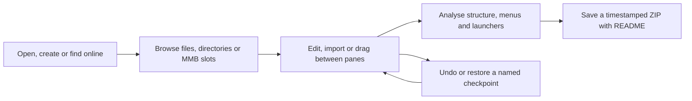
```mermaid
flowchart LR
    A[Open, create or find online] --> B[Browse files, directories or MMB slots]
    B --> C[Edit, import or drag between panes]
    C --> D[Analyse structure, menus and launchers]
    D --> E[Save a timestamped ZIP with README]
    C --> F[Undo or restore a named checkpoint]
    F --> C
```

## Online Library

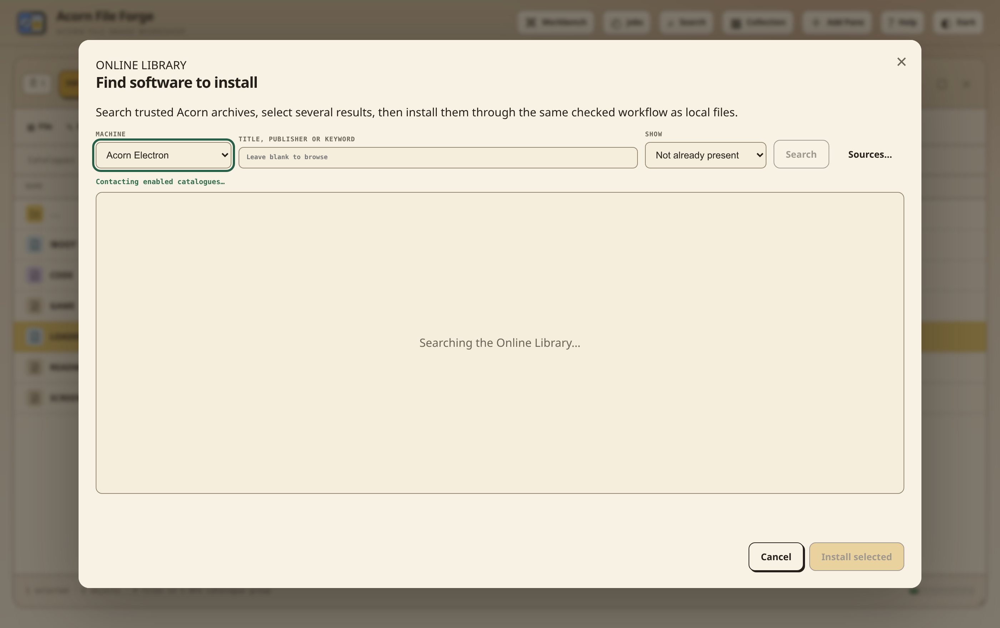

Every writable media pane has a **Library** menu. At the root of an MMB it
offers **Find disks online**; inside DFS, ADFS and RISC OS filesystems it offers
**Find software online**. It searches enabled catalogues on the server so a
browser does not need to negotiate cross-site download rules.

The initial machine filter comes from the Workbench hardware profile applied
to that pane. For panes without an applied profile, the remembered active
Workbench profile is used as the workspace default. A fresh browser starts with
Electron Plus 3. It is still only a starting value: choose another machine in
the Online Library whenever an individual search needs a wider or different
catalogue.

The built-in catalogue set is:

- Complete BBC Micro Games Archive for directly downloadable SSD and DSD
  releases, including recent homebrew represented by that archive;
- all public media categories in Acorn Electron World, including professional,
  public-domain, companion, EUG, featured, unfinished and unreleased software;
- Every Game Going for BBC Model B, B+, Master 128, Master Compact, Electron
  and Archimedes A3000 releases;
- 8-Bit Software's public-domain catalogue;
- 0xC0DE and community Electron projects with direct SSD releases;
- itch.io homebrew searches chosen from the active BBC, Master, Electron,
  Archimedes or RISC OS workbench filter;
- the official and third-party RISC OS Open package feeds.

Only records with a confirmed public UEF, SSD, DSD, ADF, HFE, ZIP or RISC OS
package download appear. The app suppresses gallery pages, documentation-only
records, DVD-only Electron World entries and catalogue records whose item page
does not contain supported downloadable media. itch.io results are checked at
their project page and shown only when a supported Acorn disk or tape upload is
actually present. Its short-lived download address is generated only when you
install the item.

Large provider indexes are checked in bounded pages. This matters for Every
Game Going, whose Electron index contains several thousand release and media
records. The initial result set contains only entries whose detail page has
already confirmed a supported download. Choose **Find more downloadable
results** to validate the next provider page; repeat until the status says that
all matching catalogue entries have been checked. Shared `BBC/Electron`
releases are classified for both machine families and are included by an
Electron search. **Not already present** reports how many verified results were
hidden; choose **All results** when auditing catalogue coverage.

Choose **Sources…** in the Online Library to enable or disable a catalogue,
change its URL, or add another compatible provider. Configuration is stored in
the persistent work volume as `catalog-sources.json`. Each provider record
contains its loading and parsing settings, including query templates, Electron
category roots, crawl paths, machine IDs, cache durations and validation
limits. Item and download path rules are configurable too.
Site-specific URLs and IDs therefore live in source configuration rather than
application logic.

The bundled defaults live in `app/catalog_sources.json`. The catalogue engine
only understands reusable loading stages such as a single page, category crawl
or machine index, reusable page layouts, embedded media query parameters, and
optional link or upload-button resolution. Machine-specific itch.io search
phrases also live in the source record.
It does not branch on a catalogue name or identifier. The copy in the work
volume contains local changes made through **Sources…**.

### Add online disks to an MMB

1. Open the MMB at **All disks** and optionally select several empty slots.
2. Choose **Library → Find disks online**, select a machine and search by title, publisher or
   keyword. A blank search browses the catalogue's current page.
3. Select the Title, Publisher, Year or Source heading to sort the results.
   The active heading shows ↑ for ascending or ↓ for descending order; select
   it again to reverse the order.
4. Choose **Not already present** to hide likely duplicates detected from MMB
   disk titles, remembered online distribution names and installed menu
   records. Punctuation and the publisher suffix saved during installation do
   not prevent a match. Choose **All results** to include them.
5. If the status says more catalogue entries remain, choose **Find more
   downloadable results**. The next bounded group is checked and merged into
   the current sortable selection without claiming unchecked links as files.
6. Select several downloadable results. Selected empty slots are preferred.
   Otherwise the app scans from the requested starting slot, wraps safely and
   finds the next suitable run. DSD images still need two adjacent slots.
7. Leave the menu option selected to pass each inserted disk through the usual
   launcher, action and PAGE review. Clear it to keep the disks off-menu.

Dragging or importing an SSD that is already open in another pane carries its
visible image title into the MMB slot. MMB-to-MMB copies retain the source slot
title. The title is shortened only to the MMB format's 12-character limit.

Multi-item installs run one download at a time and show the current title.
**Abort operation** lets the active item reach a safe image boundary, then
prevents the next download from starting. Completed items remain installed and
undo checkpoints are retained.

If one download contains the same program in several media formats, the app
uses the best native disk format once. For example, an SSD is preferred over a
duplicate UEF tape, so an MMB import does not insert the SSD and then complain
about the tape. Installing into a blank SSD adopts the source catalogue and
disk title, padding shortened SSD distributions to the target's normal size.

The catalogue title and publisher seed the review form, while the actual disk
is still inspected for `SSDMENU`, `!BOOT`, `LOADER`, action and PAGE. An
installed menu therefore receives proper source metadata without trusting a
catalogue to describe the executable layout of the image.

### Add online software to DFS, ADFS and RISC OS

For a blank SSD, the downloaded SSD catalogue and title are adopted directly.
For a non-empty SSD, DSD or open MMB disk, files are copied into the current
DFS catalogue. Normal seven-character leaf names, catalogue entry limits, side
selection, free-space checks and existing-file errors still apply.

For ADFS, downloaded disk images extract into the current directory by
default. Select **Create a folder for each downloaded disk** when the software
is self-contained or when several images would otherwise clash. The existing
DFS-to-ADFS loader checks and compatibility reporting apply to these imports
too.

An ADFS floppy is not automatically a relocatable HDD application. Its loader
may assume that `$` is the floppy root, use a DFS-only abbreviation, select a
drive explicitly, or read physical sectors. HDD extraction now follows the
reachable loader graph, including launch filenames stored in BASIC `DATA`, and
expands proven `R.`, `L.` and `LO.` commands. Proven local `$.name` references
become relative references in BASIC, or same-length `@.name` references in
embedded machine-code strings. The current directory marker keeps binary
addresses stable. Explicit filing-system or drive changes and apparent direct
sector I/O are reported as compatibility risks rather than being guessed at.
Such software should remain as a mounted floppy image unless a title-specific
HDD installer is available.

### Audit software already installed on an ADFS HDD

Choose **Tools → Check installed disk software** in an ADFS HDD pane to inspect
software which was previously extracted from floppy images. The command is not
shown for ADFS floppy images. It recursively finds installation roots from the
source-image history retained by Acorn File Forge and from conventional launch
files such as `!BOOT`, `BOOT`, `LOADER`, `MENU`, `GO` and `START`.

The first pass is read-only and can be limited to the current directory or run
across the whole HDD. Each detected installation reports its source image when
known, file count, exact deterministic repairs and unresolved warnings. Safe
repairs include proven local root references which must follow the ADFS current
directory, and unambiguous abbreviated loader commands which are unsafe after a
DFS-to-ADFS move. Explicit drive or filing-system changes and direct-sector I/O
are reported for review but are never rewritten by guesswork.

ADFS path syntax is resolved before any command warning or rewrite is offered.
For example, `R.+AP2` is preserved when directory `R` contains file `+AP2`; it
is not mistaken for an abbreviated `RUN`. This check applies to both textual
scripts and OSCLI strings reached from binary loaders.

Tokenised BASIC launchers are rewritten line by line. Commands embedded in a
`*KEY` definition, such as `*L. QBIX 1E00|M`, are recognised as keyboard macros
and can be expanded safely while preserving their control-key sequences. Every
changed BASIC line receives a rebuilt length byte. The audit also detects the
specific malformed line lengths left by older raw command rewrites and offers
to repair them before analysing the rest of the loader.

If repairs are available, select the directories to fix and choose **Repair
selected**. Choose **Cancel** to leave the image unchanged. The repair action
creates the normal automatic undo checkpoint and processes the selected batch
through one writable filesystem mount, which avoids repeatedly reopening a
large BeebSCSI DAT image. Run the audit again after repair to confirm that only
intentional warnings remain.

Saved image notices retain actual compatibility changes, but do not retain old
point-in-time loader diagnoses forever. Opening an older working session
consolidates repeated ADFS directory and Tube notices, and directs the user to
the HDD audit for current path-aware loader results. The pane reports the notice
count and latest item instead of placing the complete history in one oversized
toast. Retained byte-level repair history remains available in the generated README.

RISC OS Open packages install only into ADFS or RISC OS images. The installer
preserves application directory structure and SparkFS load, execute and
filetype metadata, while omitting the package manager's `RiscPkg` control
directory. Older ADFS formats can still reject long RISC OS names, which is a
filesystem restriction rather than a download failure.

Small remote catalogue pages are cached for 15 minutes. The larger Electron
World and Every Game Going indexes default to 24 hours, which can be changed in
their provider settings. Selected result tokens expire after an hour. Downloads
have fixed size limits, ZIP expansion is bounded, and path traversal members
are ignored. One unavailable source is reported under the remaining results
rather than cancelling a multi-source search. Availability in a catalogue does
not change a program's licence, so use the source page for permissions, payment
and release notes.

Drag an empty part of a pane heading, or its numbered grip, to place that window
anywhere in the workspace. Windows can overlap and the one selected most
recently moves to the front. Drag against an edge for a half-workspace layout,
against a corner for a quarter-workspace layout, or against the top edge to
maximise. Drag any edge or corner to resize. Double-click the grip to maximise
or restore it. A snapped pane begins resizing from its visible rectangle, and
free panes scale proportionally when the browser workspace changes size. With
the grip focused, Alt+Left and Alt+Right snap to either
side, Alt+Up maximises, and Alt+Down minimises.
Hold Shift with Alt and an arrow key to resize the focused pane in 32-pixel
steps.

There is no fixed pane-count limit. **Add Pane** creates another cascading
window whenever it is selected. Each open pane heading contains, in order, the
orange changed indicator and buttons for **New Blank Image**, **Load New
Image**, **Save Image**, **Refresh View**, **Minimise**, **Maximise/Restore** and
**Close Pane**. A minimised pane is kept on the workspace shelf and restores
with one click. Save is no longer duplicated in the file toolbar. The × closes
the whole pane, not merely the image inside it. A changed image prompts for
**Save and close**, **Close without saving**, or **Cancel**. Closing never
deletes its private working copy: use **Recover previous session** in another
pane to reopen it.
Empty panes also have a top-right ×. If every pane is closed, **Add Pane**
remains available in the header; a fresh browser workspace always begins with
one pane. Window positions, sizes, snap state, stack order and minimised state
are restored after a normal refresh and are included in project JSON exports.

After image validation, Save starts a native timestamped ZIP download and
opens a small confirmation dialog containing a direct **Download ZIP** link.
Once the download has been prepared, the orange changed indicator clears in
every pane showing that image. It returns after the next edit.
If a browser suppresses the automatic handoff after a long DAT/DSC validation,
use that link without returning to the work pane or risking the current session.
Every save uses the same foreground progress dialog. It covers validation,
checksums, the technical catalogue and construction of the complete ZIP. Small
floppy images move through those stages quickly; large DAT, HDF, RAW and MMB
images show real progress for as long as they need. The ready dialog appears
only after the timestamped ZIP is complete on disk. Starting the download then
hands an ordinary file with a known size to the browser immediately.
BeebSCSI DAT files usually contain large zero-filled free areas. Acorn File
Forge stores those areas as sparse ranges in the private working copy and its
checkpoints, calculates checksums without physically rereading sparse holes,
and uses fast ZIP compression for sparse DAT downloads. Extracting the ZIP
still produces the complete byte-for-byte DAT size required by the hardware.

Click the image filename in any pane heading to rename the working image.
Press Enter or click elsewhere to keep the new name, or press Escape to cancel.
The media extension is preserved automatically, and a BeebSCSI DAT rename also
renames its matching DSC in the downloaded ZIP. This changes the container
filename used by recovery and download, not the title stored inside its
filesystem or an individual MMB slot title.

Each pane has its own refresh button. Long operations display a progress
overlay with the current phase, item count, elapsed time, measured throughput and estimated time remaining. Dialog action buttons disable
after the first valid click, which prevents accidental duplicate imports or
copies. The controls in a pane also disable as soon as a creative,
destructive, validation, or maintenance action starts. Changes to one image
are serialized so that two writes cannot modify it at the same time.

The meter at the lower-right of every populated pane shows real filesystem
usage. It fills green, then orange at 70%, and red at 90%. Hover over it for
used, free, total, and percentage figures in appropriate units. At an MMB root
it counts formatted and empty slots; inside an MMB disk it reports that DFS
slot's byte capacity. UEF tapes show a neutral unavailable meter because tapes
do not have fixed filesystem free space.

## Undo and named checkpoints

Every request that can change an existing image begins by taking an automatic
checkpoint. If the request makes no change, that speculative checkpoint is
removed. If it succeeds, partially completes, or stops after some items in a
bulk operation, the previous state remains available through **Edit → Undo
last change**. Undo consumes the latest automatic point, so it can be repeated
to step backwards through the most recent operations. The newest 20 automatic
points are retained per working image.

Use **Edit → Checkpoints** to create a permanent named point before a large
import, compaction, menu rebuild, or directory reorganisation. The same dialog
lists named checkpoints and recent automatic points. Any listed point can be
restored, and named points can be deleted when no longer required. Restoring a
checkpoint first saves the state it is replacing as a fresh automatic undo
point.

Checkpoints include the complete working image, its matching descriptor when
present, its displayed filename, source metadata, hardware target, warnings,
and dirty state. MMB slot caches and installed-menu caches are rebuilt after a
restore. Every pane showing the restored image refreshes from the restored
bytes.

On filesystems that support reflinks, snapshots use copy-on-write cloning. A
large HDD checkpoint is therefore normally quick and initially consumes space
only for blocks that later differ. When reflinks are unavailable, the fallback
copy preserves sparse zero ranges instead of writing hundreds of megabytes of
unused DAT capacity. The logical checkpoint remains a complete byte-for-byte
image and restores normally.

Checkpoints live inside the private, owner-isolated working session. They
survive normal refreshes and container restarts with the Docker work volume,
but clearing that recovery session or removing the volume removes its
checkpoints too. They are not a replacement for downloading an important
finished image.

## Workbench and analysis tools

Every open pane has an **Analyse** menu. These tools are read-only unless a
repair or reviewed edit is explicitly selected, and normal automatic
checkpoints still protect every write.

The header **Search** command searches every distinct image currently open in
the workspace. One query covers filenames and bounded readable BASIC, command
script and text content. MMB searches include every populated slot; ADFS
searches traverse the complete directory tree; DFS, ROMFS and UEF searches use
their visible filing-system catalogues. Results identify the pane, image, MMB
slot and path. Selecting a result restores a minimised pane, brings it to the
front, navigates to the containing directory, slot or side, and opens the file
in the appropriate editor. Raw ROM banks are omitted because they are not a
filing system and already have structure, string and byte search in the ROM
Workbench and Hex editor.

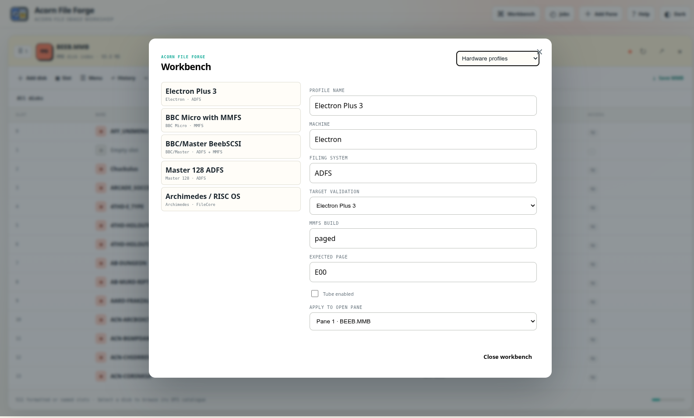

### Preflight and dry runs

Select files, directories, or MMB slots and choose **Dry-run selected items**.
The report shows the proposed objects and detects target filename conversion,
truncation, case-insensitive clashes, and operations that cannot proceed. The
existing MMB-to-ADFS planner provides the deeper format-specific preflight for
large transfers, including old ADFS directory capacity, group holders,
shortened-name collisions, existing populated destinations, blank disks, and
the exact per-slot destination.

### Unified image health

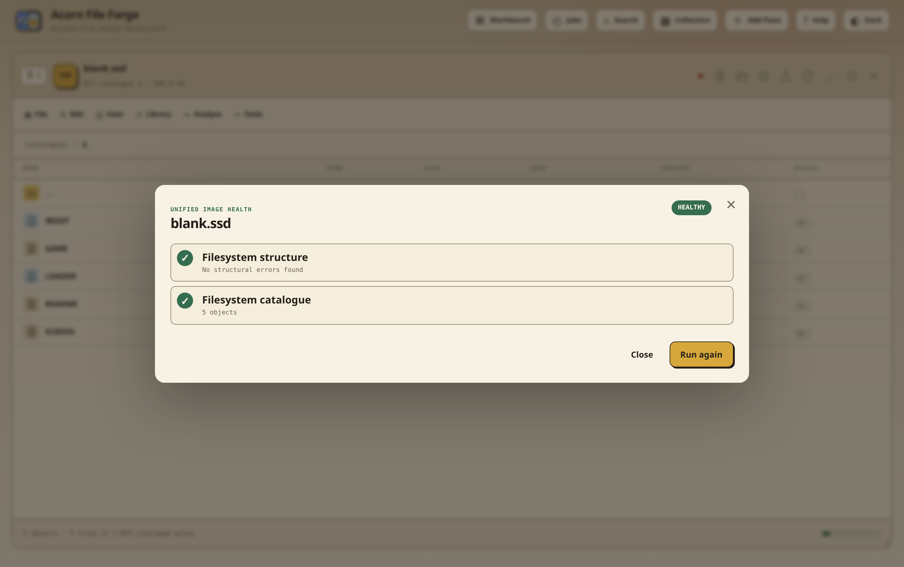

**Image health dashboard** brings the applicable checks together:

- filesystem structure and recursive catalogue access;
- MMB header state, invalid slots, installed menus and menu records;
- launch-file existence, disk-title mapping, action and PAGE evidence;
- BeebSCSI DAT/DSC geometry where present;
- compatibility warnings and the applied hardware profile.

Before the scan begins, the app warns that a large MMB or HDD may take several
minutes. The progress display names the current filesystem or menu phase, and
**Abort operation** stops at the next safe traversal boundary. Health checks do
not hash every file; full checksums remain available through manifests and the
duplicate finder, keeping routine structural checks substantially faster.

Repairs are offered only when the evidence is deterministic. For example, a
menu PAGE value can be replaced when the selected tokenised BASIC launcher has
a different saved address. Missing launchers and ambiguous dependencies remain
for review. The repair dialog itemises what is eligible and creates an undo
checkpoint before writing.

### Cheat-candidate analysis

Open one tokenised BBC BASIC or machine-code file and choose **Tools → Find
cheat candidates** in its editor. The read-only report correlates semantic
BASIC state, plausible initial values, updates and terminal paths. For machine
code it joins initialisation, access to the same storage, updates, forward
terminal branches and saved labels.
Results are grouped by likely purpose and marked Strong, Likely or Possible.

The analyser suppresses unexplained memory writes, opaque BASIC countdowns,
backward decrement loops and likely copy, clear, scan or delay counters. It
retains reachable unlabelled state changes with a forward decision as Possible,
but excludes bytes reached only by speculative linear decoding. Loader commands
and packed or runtime-generated payloads are identified instead of being shown
as an unexplained zero-result scan. It explains the evidence and the risk, then
recommends an emulator watchpoint or control-flow check. Optional online title identification and configured
specialist searches can locate published research, but never modify the image
or claim that similarly named software has identical bytes. See the
[cheat-candidate analysis guide](docs/CHEAT-ANALYSIS-GUIDE.md).

For a machine-code candidate with an exact file offset, select the result and
choose **Prepare guarded patch**. The patch builder requires the watched
address, two distinct emulator gameplay observations, an explanation and an
author. It records the complete source SHA-256, original and replacement bytes,
hardware profile and rollback instructions. Apply checks that exact hash and
the guarded bytes again, then uses the normal automatic image checkpoint. A
host-private library retains up to 500 of these small patch records and
matches by exact file content, never by a title or filename. The observations
are deliberately entered by the tester: automatic debugger-to-gameplay
correlation remains an open proof gate and the UI does not pretend otherwise.

### Opening and editing files

Double-click a file in any filesystem pane to open it. The same viewer is
available through **Analyse → Open selected file**. The app examines the
contents instead of trusting the filename:

- tokenised BBC BASIC II opens as an editable, numbered source listing;
- `!BOOT` and other recognised `*EXEC` or BASIC command files open as
  editable, unnumbered scripts;
- readable Latin-1 files open in the text editor;
- binary files open in an annotated disassembly viewer;
- UEF tape containers, including gzip-compressed or extensionless UEF files,
  reconstruct their cassette files as a hierarchy with load and execution
  addresses. Complete, unambiguous standard-block members allow same-length
  edits after a structural preservation review;
- ZIP, TAR, TAR.GZ/TGZ, TAR.BZ2, TAR.XZ, standalone GZIP, BZIP2 and XZ files
  appear as archives and open as bounded folder hierarchies in the same pane.
  Double-clicking a member extracts it in memory and opens the appropriate
  BASIC, command-script, text, disassembly or hex viewer. Supported readable
  members can be edited and written back through a verified container rebuild;
- an empty or otherwise undecodable file falls back to the hex editor.

The download arrow beside every filename exports the original file and its
Acorn metadata without opening it. This keeps opening, editing and downloading
as separate, predictable actions.

At the MMB index, every formatted slot has the same download arrow. It exports
that slot as a standalone 200 KiB SSD using the visible disk title. Empty slots
do not offer a download because they have no formatted catalogue entry.

Every row has a type icon: directories and DFS catalogue groups use folder
icons, MMB slots use disks, ROM banks use chips, containers use archive icons,
and BASIC, command-script, text and binary files use distinct document icons.
Names and RISC OS filetypes provide immediate safe classifications. Unlabelled
files up to 128 KiB are inspected through the filesystem mount that is already
open for the directory listing, so BASIC, command scripts, text, containers and
binary files normally have the right icon before they are opened. Results are
cached until the image changes. Larger unlabelled files remain generic binary
rows until opened, avoiding a costly scan of every file in a large DAT image.

The compact source window uses familiar **File**, **Edit** and **Tools** menus.
File provides Save, Save As, browser-local text export, metadata download and
Close. Save As creates a sibling inside the image and retains the original
Acorn metadata and access state. Edit provides undo, redo, cut, copy, paste,
select all, find, and case-insensitive Find and Replace, with the usual keyboard
shortcuts. Replace Next works from the current selection and wraps once;
Replace All reports its exact replacement count. Unsaved text is never
discarded without a warning. Editors open centred at a useful desktop working
size and scale proportionally when the browser window is smaller. Drag the
title bar to move an editor, drag any edge or corner to resize it, or use the
title-bar square to maximise and
restore it. Double-clicking the title bar performs the same maximise or restore
action. Movement and sizing remain constrained to the visible browser window.

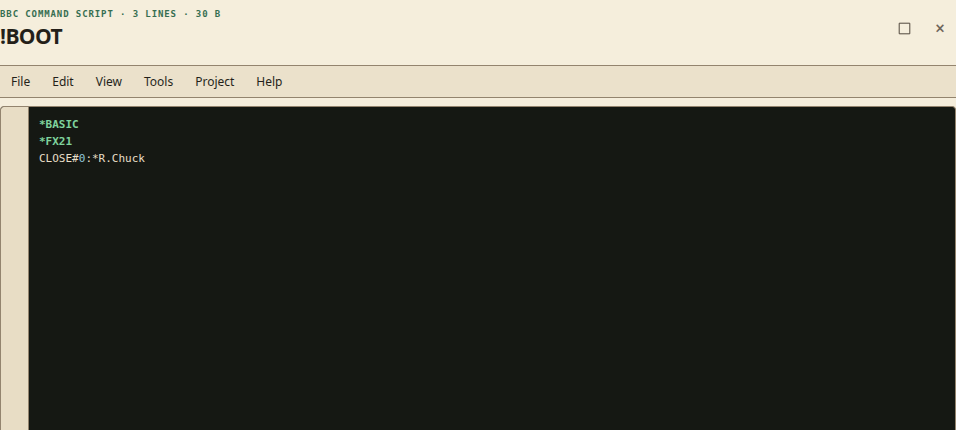

Command files remain unnumbered and retain their execution order. The editor
shown here was opened directly from the current Docker build, not recreated as
host text.

### Code-aware editing and help


Source editors highlight BBC BASIC keywords, command-script operations,
strings, numbers, comments, symbols and line numbers using colours owned by the
normal light and dark themes. The editable textarea remains the real document,
so browser undo, clipboard access, input methods, selection and the existing
checked save path continue to work normally. The coloured layer never becomes
the source of saved text.

Commands with built-in reference information have dotted hover targets. Hover
one to see its purpose, syntax, target requirements and a practical warning
where one matters. Hover help appears only after the pointer settles on a
command. Moving away, scrolling, clicking, pressing Escape, switching windows
or refreshing the code view dismisses it, and only one tooltip can exist at a
time. For keyboard use, place the caret in or after a command on
the current line and press **F1**. The editor's **Help** menu also provides:

- an overview of the detected language and the commands used in the file;
- a searchable command reference;
- live problems that jump back to the relevant source position;
- document symbols for BASIC line numbers, procedures, functions and important
  script targets.

Explicit star commands have their own help identity. `LOAD "PROGRAM"` is BBC
BASIC LOAD, while `*LOAD CODE 3000` is displayed as `*LOAD` and uses the MOS
filing-system syntax. RUN, SAVE and other overlapping names are resolved the
same way; command normalisation preserves the leading star. Compact forms such
as `COLOUR129`, `T%DIV256` and `*FX200 0` follow the real token boundaries.
One canonical language catalogue covers 8-bit BBC BASIC tokens plus the BASIC
IV and BASIC V/VI extensions. The selected dialect supplies availability
diagnostics. Standard MOS, DFS and ADFS star commands have specific help;
commands supplied by other sideways ROMs remain valid hover targets with an
explicit ROM-dependent description rather than being mistaken for BASIC.

Help also interprets useful constant operands in context. `*FX200,3` explains
both the Escape and BREAK control bits rather than stopping at "OSBYTE reason
200". The same parameter decoding applies to an `OSCLI"FX ..."` string and to
an inline-assembler OSBYTE call when immediate A, X and Y values can be proved.
Common buffer, event, keyboard-repeat and Escape calls name the selected buffer,
event or setting.

VDU help expands BBC BASIC's byte syntax before interpreting it. A comma emits
one byte, while a semicolon emits a 16-bit value low byte first. This lets the
editor explain that `VDU23,1,0;0;0;0;` disables the text cursor and recognise
the equivalent direct 6845 form `VDU23;8202;0;0;0;`. Constant colour, palette,
MODE, text-window, graphics-window, origin, cursor, plot and character-definition
sequences receive parameter-level descriptions. Dynamic expressions retain
general command help because guessing their run-time value would be misleading.
The parameter catalogue is declarative rather than a list of prose for a few
examples. It decodes the constant values present in the source for OSBYTE and
`*FX`, VDU, SOUND and ENVELOPE. Every result is compared with the hardware
profile applied to the pane. A RISC OS operation viewed in an Electron profile,
for example, still explains the operation but also states that it is outside
the configured target and may fail or behave unexpectedly. Machine-specific
hardware requirements remain visible even when the target family matches.

The Edit menu can find every code reference to the symbol at the caret and can
rename that symbol as one undoable change. Strings and comments are excluded,
so changing a variable, procedure or function name does not rewrite user-facing
text. The BASIC program outline groups procedures and functions with their call
sites. Diagnostics also report unused local definitions, mismatched `DEF PROC`
and `ENDPROC` counts, and conservatively identified unreachable lines.

Find and Replace is a persistent editor panel rather than a chain of browser
prompts. It supports case matching, whole identifiers, regular expressions,
the current selection, previous/next navigation, a replacement preview and one
undoable Replace All. **Edit → Search files in this image** searches names and
bounded readable content across the mounted filesystem, including MMB slots and
ADFS subdirectories. Results report the physical line and reopen the containing
directory before opening the file. **Tools → Analyse file dependencies** indexes
the whole image and distinguishes exact, unique-leaf, ambiguous, missing and
root-relative launcher references.

Completion at the caret is available with Ctrl+Space. It combines language
commands, identifiers, document symbols and small templates. Text and script
editors provide duplicate, move, join and delete line operations; BASIC keeps
the operations that cannot preserve line-number semantics disabled. The
conservative formatter removes trailing whitespace and normalises proven line
prefixes. BASIC formatting is offered only after a successful token round trip.
The File Properties dialog updates load address, execution address, RISC OS
filetype and writable state without changing file content.

Refactor and Condense use a two-column review with the original source beside
the proposal. Changed rows are marked, and BBC BASIC proposals are tokenised,
detokenised and tokenised again before they can be accepted. The review reports
the exact tokenised byte size and line count. **Tools → Verify BASIC round
trip** performs the same check without proposing a transformation. A retained
editor history lists accepted transformations and symbol changes made in the
current window.

**View → Show synchronized bytes** follows the source caret or selected
disassembly row and displays the corresponding saved bytes and printable text.
It is deliberately labelled as saved data when the source has unsaved edits.
The strip can open the same offset in the full Hex editor.

The tab strip keeps several files from the same mounted image open in one
editor workspace. Draft source, selection and scroll position survive a tab
switch and browser refresh, dirty tabs carry a visible marker, and closing one asks before
discarding edits. **Open from image…** searches filenames and bounded readable
content, restores the result's directory, MMB slot and side, and opens it in a
new tab. For an MMB it searches every populated slot and identifies each result
by slot number and disk title. Draft recovery is bounded and private to the
current browser tab.

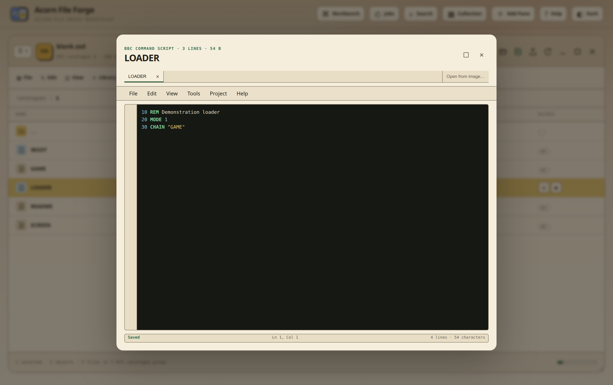

The Project menu stores notes, bookmarks, symbols, offset-bound comments and
code/data decisions with
the recoverable working session and its checkpoints. In disassembly, shift-click
selects a range. It can be marked as code, text, bytes, 16-bit words, an address
table or bitmap data, then redisassembled using that decision. Symbols can be
renamed, imported from or exported to a simple `&address = label` text file.
The outline shows labelled regions and direct callers, while Find references
jumps to decoded users of the selected address. This metadata never changes the
file bytes.

Project metadata has a single management dialog for notes, symbols, bookmarks
and portable JSON. **Compare with saved file** presents current and saved source
side by side without touching the image. The selected-data inspector can show
ASCII, hexadecimal bytes, little-endian and big-endian words, and a bounded
1-bit bitmap interpretation of a disassembly range.

Managed emulator settings live in **Workbench → Hardware profiles → Emulator
and debugger integration**. The Docker image builds the reviewed Elkulator
revision with the Pi1MHz mailbox, deterministic key injection and AP5 Tube
patches from the 1MHz WiFi project. It builds B-em with its maintained BBC B,
B+ and Master resource set, and installs MAME for Archimedes profiles. Selecting
a machine chooses a sensible emulator,
debugger, RAM size and startup action. Apply the profile to the pane that should
use it. Tests attach the current bootable image, use bounded run times, and
retain stdout, stderr and return status in project history. Raw server command
fields and deployment command overrides are deliberately not exposed.

The Docker image includes the audited `aa310` machine set and its Archimedes
keyboard device archive. The Workbench still runs MAME's ROM audit before
enabling an Archimedes session, so a missing, damaged or version-incompatible
set produces a useful status instead of a failed launch. A general MAME
`bios-devices` collection alone is not sufficient because it does not contain
the main `aa310` machine firmware.

Two further local-only integrations are optional. `ACORN_FILE_ASSEMBLER_COMMAND`
must contain `{source}` and `{output}` and may use `{origin}` and
`{architecture}`. **Edit and reassemble** starts from label-oriented assembly
source, warns that the complete binary will be replaced, invokes the configured
tool without a shell, checks the source file hash and writes the output through
an undo checkpoint. Debugger output and return status are retained in project
test history. The assembler remains an expert deployment integration; emulator
and debugger selection is managed by the workbench.

BBC BASIC listings also recognise inline assembler between `[` and `]`.
Hovering a 6502 or ARM mnemonic shows the same processor help used by the
disassembly editor. Named MOS entry points such as `OSWRCH`, their standard
absolute addresses such as `&FFEE`, and assembler directives including `OPT`,
`EQUB`, `EQUW`, `EQUD`, `EQUS` and `ALIGN` receive contextual help too. Ordinary
BASIC variables outside an assembler region are not mistaken for mnemonics.
Refactor and Condense treat assembler regions as physical source and never split
or pack their lines. Processor membership comes from one catalogue: the 56
official NMOS 6502 mnemonics, applicable W65C02 additions, and W65C816
extensions are kept distinct. In particular, W65C816 does not advertise the
W65C02 `BBRx`, `BBSx`, `RMBx` or `SMBx` instructions.

Constant call operands receive context rather than a generic entry-point
description. The editor decodes complete constant VDU byte streams, including
the comma and semicolon emission rules, and interprets the parameters of common
`*FX` and OSBYTE calls. It also decodes OSWORD blocks, OSCLI pointers, OSWRCH
characters and BASIC V/VI `SYS` SWI names. Inline assembler uses preceding
constant A, X and Y loads when they can be proved on the same physical line.
Dynamic values remain explicitly unknown instead of being guessed.

The initial BBC BASIC checks find missing, duplicate and out-of-order line
numbers, unresolved direct `GOTO`, `GOSUB` and `RESTORE` destinations, missing
local `DEF PROC` definitions and unclosed strings. Command-script checks flag
unclosed strings, filing-system-dependent `R.` and `L.` abbreviations, and the
common mistake of using `CHAIN "!BOOT"` for a file that should be passed to
`*EXEC`. These are editing diagnostics, not a substitute for running the
software on its target machine.

The **Edit** menu can jump to a physical source line or a BBC BASIC line number.
For BASIC, **Toggle comment** adds or removes `REM` across the selected lines. **Tools →
Normalise recognised commands** applies the convention for the detected
language without changing strings, comments or ordinary identifiers. BBC BASIC
and Acorn command scripts currently prefer uppercase; the operation is designed
to support lowercase conventions for other languages. Existing whole-program renumbering remains available separately
because it also updates encoded BASIC line references.

BBC BASIC procedures, `FOR` loops, `REPEAT` loops, structured `IF`, `CASE` and
`WHILE` blocks have a small minus control in the left gutter. Select it to fold
the block and use the resulting plus control to restore it. The single
state-aware **View** command reads **Collapse all blocks** while everything is
expanded and **Expand all blocks** whenever blocks are collapsed. The original textarea and saved program are never
rewritten to produce the outline. Double-click a visible outline line to expand
everything and place the caret on that line before editing. Files open with all
blocks expanded.

**View → Structure guidance** draws live 2, 4, or 8-character guide steps beside
the editable BASIC source and highlights the innermost procedure, function,
loop or structured conditional containing the caret. This is deliberately a
display option. It does not insert indentation, replace the textarea, set the
dirty state or alter tokenised bytes. The guidance updates as the caret and
source move, so normal browser editing, selection and undo remain available.
Procedures and multi-line functions are treated consistently: code after
`DEFPROCname` or a multi-line `DEFFNname` receives another guide level until
`ENDPROC` or the function's leading `=` return. The scanner understands the compact spelling
produced by tokenised listings, including `FORI%=...`, and closers later on a
physical line, including `]:NEXT`, `NEXT:ENDPROC` and
`CALL address:ENDPROC`. Compact closers such as `NEXTc%` and
`UNTILINKEY...` also end their matching visual block. A one-line
`DEFFNname(...)=expression` does not open a
block. Folding uses this same structure scan, so its controls match the visual
indentation.

**Tools → Refactor selection or program** uses the physical selection when one
exists, including a single selected line, or the complete BASIC program
otherwise. This is the single command for both untangling and wider cleanup. It normalises proven command
tokens, expands every statement boundary it can prove safe, renumbers the program from
10 in steps of 10, and updates direct line destinations, including every target
in an `ON … GOTO` or `ON … GOSUB` list. Refactor first opens a
non-destructive proposal in the code view. No line is changed or renumbered
until ✓ is selected and the confirmation is accepted; × discards the proposal
without touching the document or undo history. It deliberately does not rename
variables, alter strings, invent procedures or rewrite dynamic line expressions.
Those changes could alter BBC BASIC's semantics, memory use or computed control
flow. An accepted rewrite is one undoable editor operation and retains the
logical cursor position and viewport. Visual indentation remains view-only.
Nested `IF … ELSE IF … ELSE` chains are expanded into explicit guarded branches
whose generated targets are resolved during the proposal. A compact `ON ERROR`
handler is expanded safely using an explicit `ON ERROR GOTO` target followed by
a normal-flow jump over the extracted handler. Its former colon-separated
actions can therefore occupy separate numbered lines without running when the
handler is installed.
Every other proven statement separator is expanded, including chains on a
`DEFPROC` or `ENDPROC` line and statements inside each branch of an inline
`IF`. A line whose entire body is `:` is preserved exactly because BBC BASIC
requires an executable no-op rather than an empty numbered source line.
Compact command spellings emitted by the tokeniser, including `PROCmove(...)`,
`VDU7`, `COLOUR129` and `CHAINf$`, are recognised as statements rather than
being mistaken for computed line destinations. Standalone compact structural
forms are normalised across the complete proposal, so forms such as
`UNTILINKEY...`, `IFcondition`, `FORI%=...` and `NEXTI%` receive a readable
space even when their original physical line contained no colon.
BBC BASIC's omitted-`THEN` assignment shorthand is also recognised when both
branches assign the same unambiguous variable, for example
`IF condition path$="one" ELSE path$="two"`. Cases whose statement boundary
cannot be proved remain unchanged for manual review.

Structure guidance classifies lines created by Refactor immediately using the
same block scanner as folding. A classic `IF condition THEN line` does not open
a multi-line block, so later physical lines reached by branching or fall-through
are not shown inside it. Presentation remains view-only and no tabs or spaces
are written into the tokenised program.

**Tools → Condense selection or program** performs the inverse operation. It
packs adjacent statements onto the fewest safe physical lines with `:`, while
preserving the first surviving line number and every explicit destination. The
actual BBC BASIC tokeniser measures each proposed line, so tokenised keyword
savings are used without exceeding the 251-byte line limit. A target line always
starts a new packed line. Packing also stops after an inline `IF`, `ON ERROR`,
`REM`, `*` command or unconditional transfer, and at structured branch
boundaries. Programs that use computed line destinations or use `ERL` in
calculations or control flow are left unchanged because removing a physical
line number could alter their behaviour. Merely printing `ERL` in an error
handler is safe and does not block the transformation. Empty, untargeted
numbered lines inside the chosen range are removed.
Like Refactor, Condense first shows an original/proposed comparison with Accept
and Cancel controls, commits as
one undoable edit, and preserves the logical selection and viewport.

The parser recognises classic and structured BBC BASIC syntax, including
omitted `THEN`, nested `ELSE IF`, procedures, loops, `CASE` and `WHILE` forms.
Transformations are only enabled for dialects the installed tokeniser can write
back without changing their byte format. BBC BASIC V remains an annotated,
read-only listing at present; the app will not silently rewrite it as BASIC II.

Every emitted disassembly row has contextual hover help across 6502, 65C02,
65816, ARM and 68000 output. This includes normal processor instructions, condition and size
variants, decoder-specific mnemonics, and data pseudo-operations such as
`EQUB`, `EQUS`, `EQUW` and `EQUD`. The tooltip combines the operation family,
the exact decoded operand and addressing form, encoded bytes, cross-references
and the analyser's row comment. MOS entry points from `OSRDRM` through `OSCLI`
retain their specific calling help. An unfamiliar decoder mnemonic receives an
architecture-specific fallback instead of losing its tooltip. The Help menu
lists the operations actually present alongside the instruction and MOS
reference. Disassembly help remains advisory because data bytes can decode as
plausible instructions.
Labelled disassembly regions have the same left-gutter controls and one
state-aware **View** command. Folding only hides rendered rows, so double-clicking any visible
instruction still opens its bytes at the matching Hex offset.

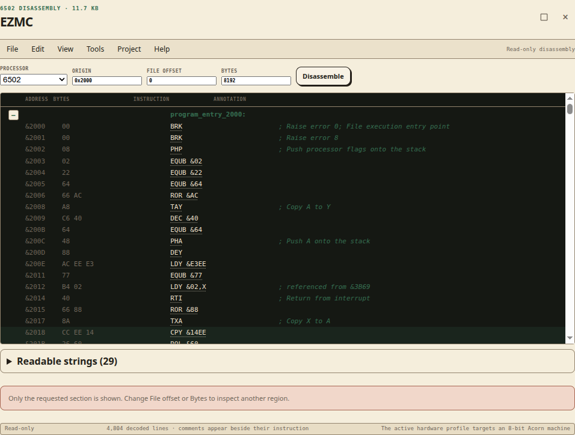

The complete operational and technical reference is in the
[file editor and code analysis handbook](docs/FILE-EDITOR-GUIDE.md).

The BASIC editor accepts complete numbered lines, so you can insert a line by
typing its number or remove it by deleting the line. Every displayed line has
a space after its line number. **Tools → Renumber BASIC** retokenises the
current listing and updates encoded targets used by statements such as `GOTO`,
`GOSUB` and `RESTORE`; numbers inside strings are left alone. Pasting offers a
choice between validating and normalising numbered BBC BASIC source or
inserting the clipboard exactly as plain text. The complete listing must still
be valid BASIC when it is saved. Existing load, execution and filetype metadata
is retained, and every save creates an automatic undo checkpoint. A BASIC II
program with a recognised trailing binary payload is editable: Save replaces
only the tokenised prefix and appends the original payload byte for byte. BASIC
V remains read-only because rewriting its extended token stream as BASIC II
would be unsafe.

The script editor is intended for files such as `!BOOT`, `LOADER`, `START` and
other content that is recognisably made from OS or BASIC commands. It does not
add line numbers. Lines are sent in order by `*EXEC` or the boot process, so
they can be inserted, removed or rearranged directly. Detection checks both
content and conventional names, while a tokenised `!BOOT` still opens in the
numbered BASIC editor.

The machine-code viewer uses the pane's hardware profile to choose 6502 for
8-bit Acorn targets or ARM for RISC OS. You can override that with NMOS 6502,
65C02, 65816, ARM or 68000, change the load origin and file offset, and request another block of
bytes. The result is shown as fixed-width source rather than a report table.
Annotations follow values only while they can be proved along the current code
path. Immediate A, X and Y values are shown, MOS calls explain their operation,
and known OSBYTE, OSWORD, OSFILE and OSFIND reason codes include the proven
parameters. OSWRCH shows the character or VDU control byte being written.
Branches explain their condition, and local routines and destinations receive
stable semantic labels rather than anonymous `sub_` and `loc_` names. Proven
behaviour produces names such as `write_text_8120`, `execute_command_834A`,
`loop_8057` and `equal_80C2`. File entry points use `program_entry_`, while
readable strings include a short, sanitised excerpt in their label. Detected
strings within the requested range are emitted directly as `EQUS` data rows
rather than left looking like accidental instructions. A referenced address
inside a string starts a separate labelled `EQUS` row so jumps and
cross-references remain exact; adjacent non-text bytes remain visible as
`EQUB`. Every
generated name retains its hexadecimal address suffix so similar routines stay
unambiguous. Hardware accesses identify the relevant BBC I/O region, execution
addresses are marked, and conventional BBC BRK error blocks are decoded into
their error number and message. Known MOS calls and cross-references appear as
semicolon comments on the instruction they describe. The string list excludes incidental punctuation and
number runs that merely happen to be printable. Select a readable string to
jump to its decoded line, disassembling that block first when necessary.
Double-click an instruction when you deliberately want Hex at that exact file
offset. The File menu exports
the formatted disassembly as text, exports the unchanged binary, or downloads
the original with Acorn metadata. Binary data can resemble instructions, so
the raw-byte view remains the final authority.

The disassembly grid measures the widest byte sequence and instruction in each
result, adds a small monospace gutter, and moves Annotation left whenever the
decoded instructions are short. Sensible caps prevent a long data declaration
from consuming the editor; hover a shortened byte or instruction cell for its
full contents. A sticky heading keeps the columns identifiable while scrolling.

Archive browsing validates member paths, ignores non-regular TAR objects and
limits archive, member and entry counts before expansion. Double-click an
archive to enter it, use its breadcrumbs or `..` to move around, then
double-click a member to inspect its extracted bytes in the normal
content-aware viewer. BASIC, command scripts and text are decoded as source;
machine code is disassembled; uncertain data opens in Hex. Readable members in
ZIP, TAR, compressed TAR, GZIP, BZIP2 and XZ containers can be edited. Save
rebuilds the complete container, checks both member and parent SHA-256 values,
then replaces the outer file through the normal image transaction and undo
checkpoint. A complete, unambiguous UEF member can also be edited when its
encoded length does not change. Before Save, the tape-project review lists
every physical chunk, its type, length and checksum, and highlights the exact
standard-data chunks that will change. The rebuild preserves chunk order,
baud-rate changes, carrier tones, gaps, security cycles and unknown chunks byte
for byte. Incomplete, overlapping, cycle-level or length-changing edits remain
read-only. Use File or the row download arrow to export any unchanged member.

UEF detection examines the content rather than requiring a filename suffix.
This means an ADFS file such as `$.UEF.THRUST` opens as a tape container even
though its leaf name has no `.uef`. Both raw and gzip-compressed UEF streams are
recognised. Each valid cassette block sequence becomes a file row; incomplete
sequences remain visible and are marked as incomplete rather than discarded.
Recovered members are labelled as tape files and classified as tokenised BASIC,
command scripts, readable text or binary data for their row icons.

Saving from the text, BASIC or file-level hex editor checks the file digest
first. If another operation changed it while the editor was open, the save is
refused rather than overwriting newer work.

**Check loader dependencies** resolves conventional targets beside the
launcher and reports missing or root-relative paths. Complete disk extraction
already copies every catalogue file, so local companion programs travel with
the launcher. The report explains when installing below ADFS root is unsafe or
needs the existing guarded root-reference rewrite.

### Raw image and file hex editor

Choose **Tools → Hex editor** to open a raw editor over the relevant pane. It
works in small ranged pages, so opening a large HDF or BeebSCSI DAT does not
copy the complete image into browser memory. A paired BeebSCSI DSC can be
selected from the Component list when its geometry needs inspection.

The same editor is available for an individual file from its BASIC, text or
disassembly view. File-level raw writes preserve filesystem metadata and create
an undo checkpoint, but can still damage tokenised source or executable code,
so they use the same explicit dangerous-change confirmation.

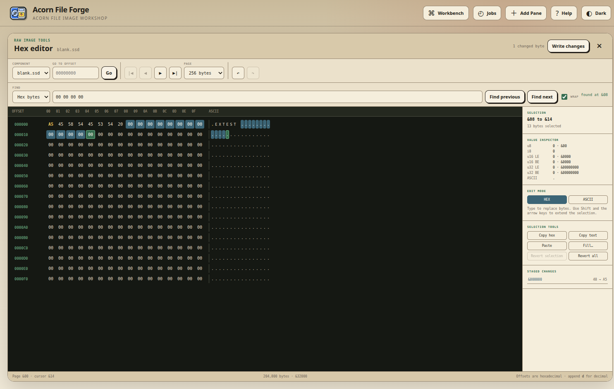

The editor provides:

- 16-byte rows with hexadecimal and ASCII cells;
- first, previous, next and last-page navigation, plus direct offset entry;
- 128, 256, 512 and 1,024-byte page sizes;
- hexadecimal and Latin-1 text search, forward or backward, with optional
  wrapping;
- fixed-size hexadecimal or Latin-1 replacement, with the matched byte range
  selected before it is staged. Search and replacement values must contain the
  same number of bytes because raw editing cannot resize an image;
- byte and range selection using click, Shift-click or Shift plus the arrow
  keys;
- hexadecimal or ASCII typing modes;
- copy as hex or text, paste, fill, revert selection and revert all;
- editor-local undo and redo before anything reaches the image;
- structured decoding for ROM, ROMFS, RISC OS module, DFS, ADFS, MMB,
  BeebSCSI DSC and UEF data, plus bounded custom JSON templates;
- unsigned 8, 16 and 32-bit value views in little and big-endian order;
- a staged-change list with direct navigation to every changed offset.

Raw edits always overwrite existing bytes. The editor cannot insert, delete or
resize an image because changing container geometry that way would silently
invalidate most Acorn filesystems. Before a write, the app displays **This is
dangerous. Are you sure?** and explains that raw edits bypass filesystem rules.
The backend checks that the image has not changed since the editor loaded it,
creates an automatic undo checkpoint, writes only the reviewed ranges, flushes
them to storage and invalidates cached catalogue and menu data. Closing with
staged changes offers Keep editing, Discard changes, or Review and write.

After a raw edit, refresh the pane and run **Analyse → Image health dashboard**.
The image remains marked as changed until its timestamped ZIP is saved. An HFE
whose advanced track data is protected can be inspected in the hex editor, but
its Write changes control remains disabled.

Useful shortcuts while the editor has focus are Ctrl/Cmd-S to review and write,
Ctrl/Cmd-Z and Ctrl/Cmd-Y for editor undo and redo, Ctrl/Cmd-F to search,
Ctrl/Cmd-H to move to replacement controls,
Ctrl/Cmd-G to enter an offset, Ctrl/Cmd-C and Ctrl/Cmd-V for byte selections,
the arrow keys to move, Shift plus the arrow keys to extend a selection, and
Escape to close safely.

### Menu test runner

For an MMB with an editable Universal or SPI menu, or an ADFS volume with an
installed directory menu, **Test menu entries** checks every record without
pretending to emulate the game itself. It verifies disk or directory
selection, launcher existence, action, and whether the stored PAGE agrees with
the actual BASIC launch path. Results are shown per title so a broken record
can be corrected in the appropriate menu editor.

The command remains disabled until a suitable menu is detected. For MMB this
means a recognised menu in any slot, even while browsing another slot. For
ADFS it means the current directory itself contains the installed menu files;
navigating away disables the command and returning to that menu root enables
it again.

### Workspace search

The header **Search** command scans every distinct open filesystem with one
query, including every formatted MMB slot. It searches filenames, filetype and
access metadata, load and execution addresses, bounded BASIC and script text,
and useful printable strings inside binary files and raw ROM banks. Recognised
MMB and ADFS menu titles, publishers, disk titles, launch actions and PAGE
values are indexed too. ROM Workbench identity, symbols, regions, notes and
saved disassembly comments participate in the same search. Enter an 8 to 64
digit SHA-256 prefix to identify exact file content; the result shows the
complete digest. Each result identifies its pane, image, path, DFS side, MMB
slot or ROM bank. Opening a result restores and raises that pane, navigates to
the containing location and opens the file, ROM Workbench tab or saved address.
Binary-string results go directly to the matching disassembly or Hex offset.
File scanning and result counts are bounded so an accidental broad query
cannot consume unbounded memory.

### Manifests, duplicates, and variants

**Export collection manifest** produces JSON or CSV. MMB JSON contains all
slots including empty ones, disk access, source names, per-disk and per-file
SHA-256 values, Acorn load/execute metadata, and recognised menu records. DFS,
ADFS, tape, and hard-drive manifests recursively catalogue their visible
objects and metadata.

An edited MMB JSON manifest can be reapplied with **Apply reviewed JSON**. Only
menu records are writable through this path. The current database must still
match the exported baseline, preventing an old manifest from replacing newer
menu work.

**Compare with open image** builds the same complete logical manifest for two
open images and matches records by filesystem location, MMB slot, DFS side or
ROM bank. Added and removed objects are separated from changed content and
metadata-only changes. A file that has moved or been renamed is reported
directly when its content, size and filesystem context provide one unique
match. Ambiguous duplicates remain separate additions and removals rather than
being guessed. Full file and slot SHA-256 values distinguish a real payload
change from allocation or directory movement. Each report includes
deterministic base and candidate fingerprints and can be exported as JSON for
review, automation or later patch planning. Comparing different filesystem
families is allowed as an inventory exercise, but the result is explicitly
marked as unsuitable for a directly applicable patch. The same report joins
that logical evidence to changed raw-byte ranges for the primary image and,
where present, its companion descriptor. Equal one-megabyte chunks are skipped
as units, avoiding per-byte range construction across large unchanged HDD
areas. The shared raw-comparison safety limit covers the first 1 GiB of the
common span and explicitly marks larger comparisons as bounded.

When two images use the same filesystem family, compatible DFS side layout and
ROM bank size, the comparison can also create an `.affpatch.zip`. Tick logical
changes to export only that reviewed subset, or leave every checkbox clear to
export the full comparison. Selective patches derive a new candidate
fingerprint and automatically close dependencies around new parent directories,
removed directory descendants and complete MMB slots. The archive contains a
readable patch plan plus only the added or changed payload bytes. Payloads are
checksummed and streamed straight into the ZIP, so a large FileCore batch does
not accumulate every changed file in application memory. Comparison, archive
creation and preflight verification report the current catalogue, checksum or
payload phase, together with byte or item counts, elapsed time, measured
throughput and ETA where meaningful. Abort stops these read-only stages at the
next stream or catalogue boundary without changing either image. Applying it
through **Analyse → Apply guarded patch** first performs a read-only preflight.
The dialog checks the format, physical layout, exact base fingerprint and
SHA-256 of every embedded payload, then shows the source and candidate names,
change counts and an itemised operation preview. The Apply button remains
disabled until that inspection succeeds. Applying the verified archive creates
an automatic checkpoint, repeats the validation before the first write,
performs the operations and verifies the complete candidate fingerprint. Abort
during application restores that checkpoint, so a partial patch is not kept. A
stale, damaged or wrong-format patch is rejected. A failed final verification
reports the first mismatched logical object and the mutation wrapper restores
the checkpoint rather than leaving a half-applied image.

**Analyse → Dry-run selected items** produces the versioned Acorn File Forge
compatibility-report document without writing to the image. It records the
source and target format, proposed target name, load and execute addresses,
access state and filetype for every selected item. Filename conversions,
directory loss and unsupported RISC OS filetype metadata are attached to the
individual item that caused them. The reviewed report can be downloaded as
JSON for automation or Markdown for a package record. Choose **Keep with saved
image** after a report passes to retain it with the working session. The next
saved ZIP includes the accepted JSON and Markdown below `Compatibility/`, and
the generated README identifies the accepted operation and review time.

The same report is now mandatory before a cross-format batch started by pane
drag and drop, Cut/Copy/Paste, **File → Insert File**, folder import or Online
Library. It is built before the first destination write. Blocking name clashes
or directory losses stop the operation, while reviewable conversions remain
attached to the individual item. Online Library displays the report inside its
existing results dialog and requires a second Install action after review.
When ADFS imports create child directories, their final ten-character names
are allocated against the complete selected batch and the destination's
existing entries before review. Truncation collisions receive stable numeric
suffixes, and the server rechecks each name as it writes. A genuinely blocking
report offers **Change selection or import options**; it never presents a
disabled control labelled as though it could resolve the problem itself.

### Hardware deployment packages

Choose **Tools → Build hardware deployment** in any applicable pane to build a
checked directory tree for Gotek/FlashFloppy, MMFS, BeebSCSI, Pi1MHz or a RISC
OS host. The assistant works on an isolated sparse snapshot. Hardware
finalisation, hashing and package generation therefore do not advance the disc
ID or otherwise alter the image still open in the workspace.

The validation screen lists exact target paths, sizes, SHA-256 values,
hardware-profile warnings and the manual installation checks. Download remains
disabled when a finding is blocking. A changed source revision also invalidates
an approved plan before download. The ZIP contains the target media tree,
`README.md`, `Deployment/manifest.json` and the Markdown compatibility report.
Gotek packages support native filenames and indexed `DSKA0000` navigation;
MMFS uses a root `BEEB.MMB`; BeebSCSI uses the matched
`BeebSCSI0/scsi0.dat` and `scsi0.dsc` layout; Pi1MHz produces a merge tree that
does not replace firmware or configuration; RISC OS packages retain controller
attachment as an explicit manual step. The complete procedure and limits are
in the [hardware deployment guide](docs/HARDWARE-DEPLOYMENT-GUIDE.md).

**Find duplicates / variants** uses full SHA-256 hashes for byte-identical
content and a conservative normalised-title comparison for likely release or
side variants. It reports candidates rather than deleting anything.

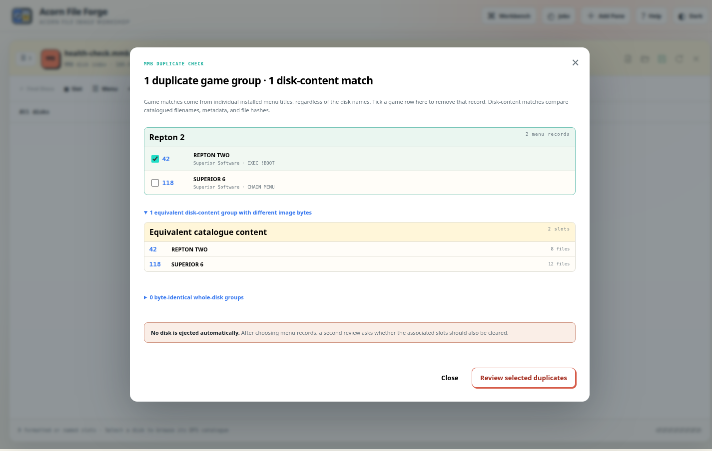

At the MMB **All disks** level, **Analyse → Check for duplicate games** checks
individual game records as well as disks. There is no second duplicate button
in the root toolbar. Installed menu titles are compared across different disk
names, so the same game on two differently labelled disks is reported.
The scan also fingerprints each disk's catalogued filenames, load and execution
metadata, sizes, and SHA-256 file hashes. This finds equivalent disk contents
whose MMB headers or disk titles differ. Byte-identical whole-slot matches are
kept as a separate strongest signal. If a supported editable menu is installed,
each duplicate game row includes its own removal checkbox beside the slot and
disk title. There is no repeated cleanup list below the results. Every checkbox
starts clear.
A final review asks whether each associated disk should remain in its slot or
be ejected. Multi-game disks list every other affected title before offering
to clear the slot and remove all of its records. Keeping the disk performs the
normal menu-only cleanup. The complete operation receives one automatic undo
checkpoint.

The image health dashboard itemises every failed menu record. Each finding
shows its record number, title, menu location, target slot or directory, disk
title, launcher and action, PAGE, exact problem, and the evidence found in the
loader. This makes a failed menu audit useful without running a second report.

Online Library's **Not already present** view compares results with disk
titles, remembered online distribution names, and installed MMB menu records.
Punctuation and the publisher suffix saved during an online import do not stop
an installed title from being recognised.

### Hardware profiles and import recipes

The header **Workbench** includes reusable hardware profiles for stock Electron,
BBC B, BBC B+, Master 128 and Archimedes systems, together with common DFS,
ADFS, MMFS and BeebSCSI configurations. The supplied custom Electron profile
combines RH Plus 1, RH Plus 2, Plus 3, AP5, Master RAM Board and BeebSCSI. A profile starts
with a base machine and adds only compatible chassis, disk interfaces, memory,
mass storage, Tube processors, PiTubeDirect or Archimedes podules. PiTubeDirect is
available for BBC B, BBC B+, Master and Electron profiles; Electron configurations
also require an AP5 Tube interface. Mutually exclusive choices
use dropdowns, while genuinely cumulative hardware uses bounded checkboxes.
Required carrier or bus expansions are selected automatically, and removing a
dependency also removes any combination that can no longer exist.

A profile also records the Online Library filter, filing system, MMFS build,
expected PAGE, ADFS validation target, and managed emulator, debugger, RAM and
startup choices. Custom profiles are stored in the current host's private state and the applied
profile is also persisted with the private image session. The health dashboard
highlights conflicts such as using the Tube with Electron or low-PAGE MMFS
software. The active Workbench profile is remembered and supplies the workspace
default used by **Library → Find disks online** and **Find software online** on
panes without their own profile. Selecting,
saving, or applying a different profile changes that default.

Pane **Tools** menus and file editors use that same effective profile for every
emulator and debugger capability check. A DFS SSD/DSD, ADFS floppy, supported
ADFS hard disk or tape can be mounted and run directly from its pane. The MMB
index accepts one formatted slot at a time; the selected 200 KiB disk is copied
to temporary SSD media before launch, so emulator writes cannot alter the MMB.
The same commands remain available while browsing inside that slot. Multiple
selected slots cannot be launched as one drive.

Opening a BASIC program offers three explicit launch paths:
tokenise and inject the current editor buffer into a temporary bootable floppy,
mount and boot the complete parent image, or mount the parent without autoboot.
The isolated test includes unsaved editor text but no companion files. Parent
mounting retains dependencies and is offered only when the selected emulator
supports that container. Messages name Elkulator, B-em or MAME as appropriate
instead of reporting capabilities from a different machine profile.
Expected ALSA and virtual-X shutdown chatter is suppressed. Retained results
still show meaningful ROM and Tube setup notices, the emulator, machine, launch
mode and whether the bounded test window completed normally.
Interactive Run and Debug open the managed emulator in a browser-embedded noVNC
display on port 8668. The viewer supports full-screen display and an explicit
Stop and close action. Only one managed interactive emulator runs at a time.

The Tools menu also shows a separate whole-MMB target for Electron MMFS
profiles. Acorn File Forge builds a private, deterministic FAT32 card containing
the current image as root `BEEB.MMB`, attaches it through the Pi1MHz raw-SD
adapter in the bundled Elkulator build, loads the selected paged or unpaged
MMFS ROM, and starts drive 0. The working MMB is never given to the emulator.
Run and Debug therefore cannot corrupt it. BBC and Master profiles still state
that their selected emulator has no corresponding whole-card adapter; one-slot
launch remains available there.

The installed-menu preview can capture the actual MMFS display. It boots the
isolated card on a private X server, records a settled PNG, sends one navigation
key, records a second PNG and stores both hashes, the changed-pixel count,
machine, MMFS build, menu slot and exact source-image hash. Run the capture
twice to establish repeatability. Image Health accepts a passing whole-MMB
evidence row only when the same revision reproduces its screen hashes and the
input visibly changes the display. Static launcher and PAGE checks remain
itemised separately, so screen evidence never hides a bad menu record.

Online Library search results carry short-lived server-side download tokens.
They are retained for one hour in the private application work area, so a safe
container restart does not invalidate a search dialog that is already open.

Import recipes record the directory naming strategy, group prefix, online
metadata preference, guarded compatibility rewrites, and whether copied titles
should be offered to a menu. They appear in the bulk MMB-to-ADFS planner and
can be adjusted for exceptional disks without changing the saved recipe.

Every ADF, SSD and MMB-to-HDD import uses the same global-menu choice. Keep the
current disc off all menus, create or update a Universal Menu at the current
ADFS directory, or add it to any detected Universal Menu elsewhere on the
volume. A menu-bound title is always installed in its own child directory
beneath that menu root. Bulk MMB plans add a per-disc Menu checkbox, so one
batch can contain both listed and deliberately hidden software. MMB-only menu
programs such as SPI Game Menu and MMC Desktop are shown as inapplicable to an
HDD because their launchers use `*DIN`; the bundled Universal Menu is the menu
program which understands ADFS directory records.

### Portable projects

Workbench can export an `.aff-project.json` description containing all open
pane positions, image names and private session references, current MMB
slots or ADFS paths, hardware profiles, and import recipes. Importing it on the
same retained installation restores that working context. Theme remains a
browser preference rather than part of the imported project. The project is
kept small by referring to private working sessions; image bytes remain in the
Docker volume and in the normal timestamped image ZIP backups.

The same **Portable project** screen can export a completed image as a
deterministic workflow bundle. It starts from the earliest retained pre-change
checkpoint, builds and proves a guarded `.affpatch.zip`, records the physical
and logical identity of the required base image and DSC companion, and
calculates the exact hashes produced by that deterministic replay.
Hardware-profile choices and accepted
compatibility reports are retained as non-secret decisions. The bundled
README gives the complete `recipe-run` command. Rebuild stops if the base,
descriptor, patch payload or final output differs from the recorded identity.
Original image bytes are not duplicated in the workflow ZIP.

This facility covers writable DFS, MMB, ADFS, ROM and ROMFS sessions. UEF and
HFE workflow export remains disabled because replay must preserve their tape
timing or track-container details, not merely the decoded filesystem.

### Persistent jobs

Long transfer records are written to `operations.json` in the work volume.
The header **Jobs** panel shows the phase, item count, completion state, time,
completed and skipped disks, and errors even after the foreground dialog
closes. A restart changes unfinished records to **interrupted** instead of
losing them. Resumable MMB-to-ADFS jobs retain their safe request plan and omit
already completed or skipped source slots when **Resume** is selected. Abort
still stops only at a safe filesystem boundary.

## Supported media

| Media | Common names | What Acorn File Forge can do |
|---|---|---|
| Acorn DFS | SSD, DSD | Browse catalogue prefixes, add, export, rename, delete, lock, compact, validate, and copy files |
| MMB | MMB | Browse all slots, create or insert disks, set read-only/read-write access, edit embedded DFS disks, drag to cut and paste slot blocks, and maintain Universal or SPI game menus |
| ADFS and FileCore floppy | ADS, ADM, ADL, ADF, DSK | Create, traverse and edit S/M/L/D/E/E+/F/F+/G/G+ directories, files and metadata |
| Acorn hard drive | DAT with DSC for old-map BeebSCSI, HDF, HD4, HDD | Browse and edit hierarchical old-map and new-map FileCore volumes, including HDF images with the emulator header offset |
| Raw drive dump | IMG, RAW, BIN, extensionless images | Identify the filesystem from its contents, then open it as DFS or ADFS |
| Acorn cassette | UEF and compressed UEF | Reconstruct ordinary tape files, export them, drag them to disks, or convert them to SSD or DSD |
| HxC floppy container | HFE v1, v2 and v3 | Decode DFS or ADFS sectors for browsing and extraction; safely edit ordinary HFE v1 disks and save them back with their original track layout |
| Acorn ROM | ROM, ROM0-ROM7, recognised BIN | Inspect BBC-family headers, browse and rearrange banks, edit bytes and titles, build custom images, and combine or split byte-wide chip sets |
| Acorn ROMFS data ROM | ROM identified by its catalogue | Browse, create, add, export, rename and delete files; retain load/execute metadata; set run-only protection; edit ROM identity; validate every block CRC |

The file extension is only a hint. Generic names such as `HardDisc4`,
`drive.img`, or `backup.bin` are inspected by content. A DFS image renamed to
`.bin`, for example, is still opened as DFS.

### Images you can create

Use **File → New → New Image (current format)** to start with the format that
matches the current pane. An unused pane is selected automatically, and a new
pane is added when every existing pane contains an image. It opens as another
cascading workspace window, without replacing or prompting to save an existing
image. The familiar image-creation dialog then offers:

- DFS SSD, 200 KiB
- DFS DSD, 400 KiB
- ADFS S floppy, 160 KiB
- ADFS M floppy, 320 KiB
- ADFS L floppy, 640 KiB
- FileCore ADFS D floppy, 800 KiB
- FileCore ADFS E floppy, 800 KiB
- FileCore ADFS E+ floppy, 800 KiB with Big directories
- FileCore ADFS F floppy, 1.6 MiB
- FileCore ADFS F+ floppy, 1.6 MiB with Big directories
- FileCore ADFS G floppy, 3.2 MiB
- FileCore ADFS G+ floppy, 3.2 MiB with Big directories
- HFE-wrapped DFS SSD/DSD and ADFS S/M/L floppies
- BeebSCSI ADFS hard drive as a matched DAT and DSC pair
- Archimedes or RISC OS virtual hard drive in HDF form
- Raw physical-drive image
- MMB bank with 511 empty slots
- Acorn ROM from 256 bytes to 64 MiB, with a configurable bank size, erased byte, platform and linear, two-chip or four-chip byte layout
- Acorn ROMFS data ROM in standard 8 KiB or 16 KiB form, with platform, title, version and copyright defaults

Hard-drive capacity is entered as a size such as `4MB`, `20MB`, or `512MB`.
The size field follows the selected format. Fixed-size DFS, ADFS floppy, HFE,
and MMB choices show their actual capacity in a read-only field. BeebSCSI,
HDF, and RAW hard-drive choices keep the field editable and preserve the last
typed HDD capacity while switching between formats.

ROM creation defaults to a 16 KiB bank. Choose erased bytes for a clean device
image or an inert BBC-family language and service header skeleton as a starting
point for custom code. Total size and bank size are independent, so 8K, 16K,
32K and 256K banked devices can be represented without padding an existing
image behind your back.

The target-hardware control follows the format too. It is disabled as not
applicable for DFS and MMB, fixed to BeebSCSI for a DAT/DSC pair, and fixed to
Archimedes / RISC OS for HDF and RAW hard drives. It remains selectable for a
normal ADFS S, M or L floppy because the same floppy geometry can be used by
more than one Acorn system. An MMB has no bank-wide filesystem title, so its
title field is disabled. Each disk inserted into the bank keeps its own title.

When adding a recognised SSD, DSD, HFE, ADFS, MMB or UEF image to an open ADFS
hard drive, Acorn File Forge uploads it once and shows a bounded catalogue
preview before anything is written. Extraction defaults to the directory
currently shown in the pane. Optionally open the directory picker to choose a
different existing destination, and optionally create a named child directory
inside that destination. The original image can instead be retained as an
ordinary file. Direct extraction never overwrites an existing name. It creates
an efficient rollback copy of the working image first, so a failed or aborted
copy restores the destination instead of leaving a partial import behind.

The filesystem engine checks whether the requested geometry is valid. A newly
created BeebSCSI image remains linked to its DSC while it is edited and
downloads as a hardware-ready ZIP containing `BeebSCSI0/scsi0.dat` and
`BeebSCSI0/scsi0.dsc`. Extract the ZIP into the root of the BeebSCSI SD card
and keep the `BeebSCSI0` directory. The firmware does not scan the card root
for DAT/DSC files. Newly created pairs are also checked against the firmware's
256-byte sector, 33-sector track, 16-head and ADFS 21-bit size limits. Their
old-format ADFS root directory is written with the CR-terminated name and title
fields expected by the original BBC ADFS ROM, rather than relying on the more
permissive parsing used by modern desktop tools.

## Drag and drop

Drag and drop is format-aware. The application will only offer an operation
that makes sense for the target filing system.

The same format-aware transfer rules are available from a conventional pane
menu bar. **File** and **Edit** are always first, followed by **View**,
**Library**, the format-specific **Menu** when applicable, **Analyse**, and
**Tools**. File contains image open/save plus add/create actions. Edit contains
clipboard commands, Undo and Checkpoints. View contains refresh, MMB return and
DSD-side commands. The pane-heading icons remain quick shortcuts.

Open **File** to insert a file or create the directory/catalogue object supported
by the current filesystem. Open **Edit** for **Cut**, **Copy** and **Paste**.
The clipboard is intentionally single-use: browsing and selecting a destination
keeps it, while a successful paste, cancelling paste, pressing Escape, or
starting another image-changing operation clears it. Use Ctrl/Cmd-X,
Ctrl/Cmd-C and Ctrl/Cmd-V when a pane has focus.

MMB selections preserve their relative slot offsets. A cut may overlap its own
source range because those source slots are treated as available during the
atomic move. Copying onto occupied slots lists the exact slots and titles before
replacement. Pasting loose files at the MMB index does not pretend that slots
are directories. Instead, the app asks whether to build SSD or DSD media,
previews the required consecutive slots, applies DFS seven-character names and
one-character catalogue groups, and splits the files across more disks or sides
when the 31-entry or 200 KiB side limit requires it.

**File → Insert Folder & Contents** provides a batch host-folder import. On ADFS floppy and
hard-drive images, review the preflight and choose either to recreate the
selected folder tree beneath the current directory or flatten every file into
the current directory. DFS cannot store nested folders, so it offers the flat
import only and applies the normal seven-character name rules. At the MMB disk
index, **Insert folder of disk images** searches the complete selected tree for
SSD, DSD, DFS-formatted HFE and ZIP distributions, ignores unrelated files, and
inserts the matches from the chosen or next empty slot. The folder picker
selects one tree; drag several folders onto a pane when the browser supports
multi-folder drops. A single preflight lists the operation and ignored files
before the image changes, and ADFS/DFS folder batches use one filesystem mount
and one undo checkpoint rather than one request per file.

When several loose files or disk images are selected, the first review dialog
offers **Apply to all remaining**. That accepts each later item's own detected
defaults, legal filename and source metadata rather than stamping the first
file's load or execute address onto the complete batch. The same shortcut is
available for repeated ADFS and MMB menu-metadata reviews. Image-to-image copies
read load, execute, access and filetype metadata from the source catalogue.
Loose host files do not normally contain those values, so Acorn File Forge also
recognises companion `.inf` sidecars and common `name,load-exec` filenames. It
uses neutral metadata only when no reliable source exists.

Double-clicking an ordinary file opens the appropriate BASIC, text,
disassembly or hex view. The download arrow beside the filename exports a small
ZIP containing the loose file and its matching `.inf` sidecar. The sidecar
records the real catalogue path, including a DFS prefix such as `R.PROGRAM`,
plus the load address, execute address, length and lock
state, so moving the file through a modern host filesystem does not discard its
Acorn identity. Complete SSD, DSD, ADFS, HFE and MMB image saves do not receive
a bogus image-level `.inf`: those formats already carry the metadata internally
and their download ZIP includes the technical README and catalogue instead.
DAT saves continue to include the required matching DSC geometry file.

### Files and directories


- Use **File → New → New file** in a writable SSD, DSD, MMB disk, ADFS floppy or
  ADFS hard-drive directory. The filename is constrained to that filing
  system's limit, the initial file is zero bytes, and its load and execution
  addresses default to `&00000000`. Existing files are never replaced.
- File-level panes have separate **Load** and **Execute** columns. Values are
  shown as complete eight-digit Acorn catalogue words. DFS sign-extended
  addresses are presented in their conventional form, such as `&FFFF1900`,
  rather than exposing the packed catalogue representation.
- Select either address value to edit both words together. The confirmation
  warns that an incorrect load or entry address can crash the software. On a
  RISC OS-style FileCore entry it also explains that the words can encode the
  filetype and timestamp. The edit changes catalogue metadata in place and
  does not rewrite the file payload.
- Read the [catalogue metadata guide](docs/FILE-METADATA-GUIDE.md) for the
  format-specific representation, `.inf` syntax, metadata priority and a
  practical verification checklist.


- Choose **File → Insert Folder & Contents** or drop a host folder to import a complete batch.
  ADFS defaults to preserving its hierarchy and also offers a flat import. DFS
  imports the regular files into the open catalogue group because its directory
  letters are prefixes rather than real folders. Name shortening is shown in
  the preview. Existing ordinary files are replaced only when the explicit
  replacement option is selected.
- Select **File → New → New folder** in a writable ADFS floppy or hard-drive pane to create a
  directory at the current location. The name is checked against the target
  format before the image is changed.
- DFS media use **File → New catalogue group** instead. The pane opens on `$`.
  Default-catalogue files appear first, followed by a visual gap and the files
  in each populated A-Z prefix, displayed as `R.FILENAME` and grouped by prefix.
  These remain flat DFS names, not directories, and can be opened, downloaded,
  renamed, deleted, protected, copied or dragged directly. Because DFS cannot store an empty group,
  **New catalogue group** asks for the first file that will use a new prefix.
- Double-click `..` to move to the parent directory. Inside an MMB disk, the
  root-level `..` row returns to **All disks** at the same slot.
- Drag one or several DFS files onto a catalogue row to move them between
  prefixes. The same operation works between two panes showing the same SSD,
  DSD side or MMB slot.
- Drag a file between any two writable filesystems.
- Drag an ADFS directory to another ADFS image to copy its complete tree.
- Within one ADFS image, drag files or complete directories onto another
  directory to move them. Open the same image in multiple panes when it is useful
  to keep the source and destination visible at once.
- Select several ADFS rows before dragging to move the whole selection in one
  operation. A populated destination is never overwritten silently.
- Drag a UEF file to DFS or ADFS to copy the reconstructed tape payload.
- If the destination cannot accept the source name, a dialog asks for a legal
  replacement.
- Load and execute addresses, RISC OS filetypes, dates, and access flags are
  preserved where the destination format supports them.
- ROM banks can be dragged or copied between ROM panes. A drag within the same
  image is an atomic move, including overlapping ranges. Copy a bank to DFS or
  ADFS to create a binary with load and execute addresses of `&8000`. Pasting
  loose files into an MMB still builds proper SSD or DSD media first.

### Complete images

- Drag an open SSD, DSD, HFE, ADFS floppy, HDF, raw drive image, or MMB header
  onto an ADFS pane. Acorn File Forge previews the source and defaults to
  copying into the current directory. A picker can select another existing
  directory, with an optional new child directory inside it.
- Drop a supported image file from the host onto an open ADFS pane. You can
  preview and extract its contents using the same destination controls, or
  store it as an ordinary file.
- ZIP distributions are accepted when opening an image, extracting an image
  into ADFS, or inserting disks into MMB. A ZIP dropped into MMB can contain
  several SSD/DSD/HFE members and they are allocated in archive order. Opening or
  extracting a ZIP requires one supported image; a matching DAT/DSC pair
  counts as one image. Unrelated text and artwork files are ignored.
- Drop an SSD, DSD, HFE, or ZIP containing them onto an empty MMB slot to
  insert it. The HFE must contain a DFS disk.
- Select an empty MMB slot and use **File → New → Insert new disc image** to run
  the normal creation workflow for a formatted SSD or DSD. Existing host and
  open-pane media remain under the ordinary File menu. New blank media is useful
  for save disks and user-writable data.
- Use **File → Insert folder of disk images** to scan a host folder recursively.
  The app flattens supported disk images into MMB slots in discovery order and
  reports unrelated files that will be ignored before insertion begins.
- Drag an open DFS disk onto an empty MMB slot in another pane.
- Use the download arrow beside a formatted MMB slot to save that individual
  disk as a standalone SSD without opening it first.
- Drag one or several selected MMB slots onto a destination slot to perform the same atomic operation as Cut and Paste. Relative gaps are retained, overlapping moves are safe, and unrelated occupied slots are replaced only after confirmation.
- Drag an MMB slot onto ADFS to create a named directory containing the slot's
  DFS catalogue.
- Copy and paste does the same extraction. A cut uses a copy-first transaction:
  only slots whose ADFS directories completed successfully are ejected from the
  source MMB, using the normal menu-aware ejection path.
- DFS directory letters become ADFS subdirectories. Extraction starts at the
  DFS virtual root rather than only catalogue directory `$`, so compilation
  disks with launchers in `A`, `B`, `C`, `D`, and other directory letters keep
  every file. Existing MMB menu records can then resolve those complete paths
  without unnecessary launch prompts.
- Multiple selected MMB slots can be copied together. The planner uses the
  mounted directory layout: Old directories hold 47 entries, New directories
  hold 77, and Big directories are capacity-dependent. Batches are divided
  among editable groups such as `DISCS1` only when the detected limit requires it.
  Interrupted batches remember completed slots while their dialog remains
  open, allowing **Copy** to continue with only the remaining disks.
- The bulk preflight is a wide, fixed-height planner. Naming strategy,
  editable parent groups, and the ADFS menu choice remain visible beside a
  dense scrollable table of slot-to-directory mappings. On a normal desktop
  only the table scrolls, so the summary and Copy button stay visible.
- When a formatted MMB slot has an empty DFS catalogue during a bulk ADFS
  copy, the foreground dialog shows its slot number and title. Choose
  **Skip this disk and continue** or **Abort bulk copy**. Completed directories
  are retained, skipped disks are listed in the completion warning, and no
  empty ADFS directory is created. Blank SSD and DSD images can still be
  inserted into MMB.
- If a destination directory already exists during a resumed batch, choose to
  keep it and continue, replace and recopy it, or abort. An empty existing
  directory is reused automatically without prompting. Replacing a populated
  directory is always an explicit choice because it recursively removes the
  existing directory first.
- Before a bulk copy starts, all shortened ADFS directory names are checked
  together and case-insensitively. If shortening would create a collision, use
  the default generic `DISC-0000`, `DISC-0001` naming scheme or review the
  highlighted names manually. Parent group directory names are always editable;
  `DISCS1`, `DISCS2`, and similar names are suggestions rather than fixed names.

### Bulk MMB-to-ADFS naming and recovery

The complete destination plan is checked before the first disk is copied.
Names are compared case-insensitively within the parent directory where they
will be created. This matters because two distinct long MMB titles can become
the same ten-character ADFS name after shortening.

When that would happen, the dialog offers two choices:

1. **Use generic unique names**, which is selected by default and proposes
   `DISC-0000`, `DISC-0001`, and so on.
2. **Review shortened names**, which restores the proposed short names,
   highlights collisions, and requires every name to be legal and unique
   before copying can begin.

The generic leaf name affects only the ADFS directory. The original MMB slot
number and title remain available to metadata detection and menu generation.
If grouping is required by the detected directory-entry limit, every suggested
parent group name is editable before the operation starts.

Generic names prevent collisions between the outer disk directories. DFS also
allows a literal dot inside a seven-character filename, while ADFS uses the dot
as its directory separator. During extraction, a DFS name such as `eS.Rob`
therefore becomes the equivalent ADFS path `eS.Rob` inside the disk directory.
This preserves the complete catalogue name and keeps `eS.Rob`, `eT.Rob`, and
other same-leaf files distinct instead of silently overwriting one another.

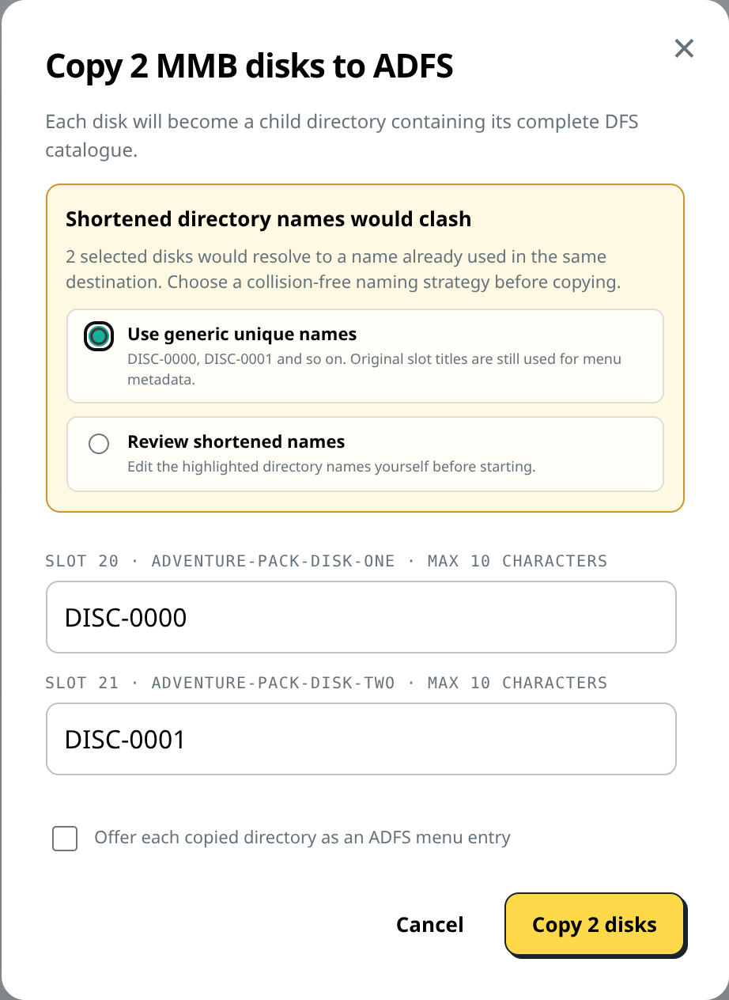

Destination checks are deliberately conservative:

- A directory that exists but contains no children is reused automatically.
- A populated directory pauses the batch and offers **Keep existing and
  continue**, **Replace and continue**, or **Abort bulk copy**.
- Keep leaves all existing content untouched and skips that source disk.
- Replace recursively removes the populated directory, recopies the current
  disk, and then continues.
- Abort keeps completed directories and starts no further disks.
- A same-named ordinary file is never considered an empty directory and is
  never overwritten silently.
- Distinct dotted DFS filenames are expanded into their corresponding ADFS
  subpaths before any file is written, so an internal name collision cannot
  stop a generic-directory batch part way through.

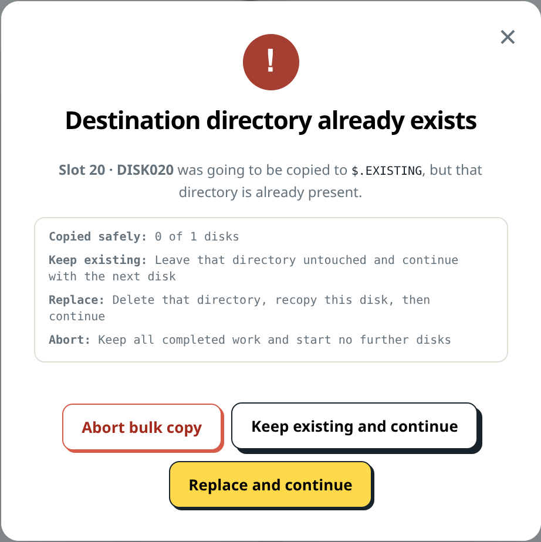

DSD insertion needs two adjacent empty MMB slots. The two sides become two
200 KiB SSD slots, which is how MMB stores that content.

When another pane has an SSD, DSD, DFS-formatted HFE, or an individual MMB
disk open, select one empty destination slot and use **File → Import from open
&lt;filename&gt;**. One command is shown for each other open image. Incompatible
ADFS images and MMB panes that are still at **All disks** remain visible but
disabled, with the reason shown beside them. This keeps the operation within
MMB's DFS-only format restrictions. A DSD imported this way still needs two
adjacent empty slots.

Use ◆ or ◇ in the Access column to mark one disk, file, or every applicable
item in a multiple selection read-only or read/write. Empty MMB slots have no
access state until a disk is inserted.

Dropping a whole image onto DFS as an extracted tree is not offered because
DFS has no hierarchical directory model and has much tighter catalogue and
space limits. Individual files can still be dragged across.

## Working with SSD and DSD

DFS rules are enforced before a write is attempted:

- Leaf names contain at most seven characters.
- DFS directory prefixes contain one character.
- A standard catalogue holds at most 31 files per side.
- A file must fit in the available contiguous sector layout.

DSD images expose side 0 and side 2 separately, matching BBC drive numbering.
Compaction can optionally prioritize boot files or another requested order.

## HFE floppy images

HFE is a track and bit-cell container rather than a filing system. Acorn File
Forge uses the official HxC conversion engine to expose the DFS or ADFS sectors
inside an HFE, then presents them through the normal file browser.

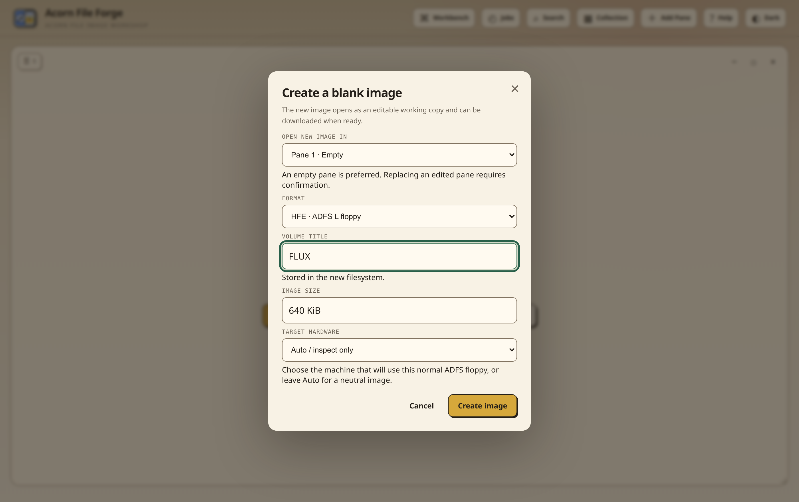

- Ordinary HFE v1 images with clean sector data are editable. Saving encodes
  the changed sectors against the original HFE as a reference, decodes the new
  file again, and byte-compares every sector before offering the download.
- HFE v2/v3 images, images with reported bad sectors, weak bits, variable
  timing, protection data, or other advanced track features open in a
  read-only safe view. Files may still be inspected, exported, or dragged to
  another image.
- DFS-formatted HFE images can be inserted into MMB slots. An HFE can also be
  extracted to an ADFS directory just like its underlying SSD, DSD, or ADFS
  disk.
- New HFE images can wrap DFS SSD/DSD and ADFS S/M/L floppy formats.
- Inserting an advanced read-only HFE into MMB intentionally copies only its
  readable DFS sectors. MMB has no place to store HFE timing, weak-bit, or
  protection information, so the destination receives a visible warning.

The pane badge reads `HFE`, while navigation and file rules follow the decoded
DFS or ADFS filesystem. A read-only HFE is labelled `Read-only safe view` and
does not offer editing, compaction, or menu-writing controls.

The original HFE remains untouched in the session until a verified replacement
has been produced. This matters because an apparently normal catalogue can
coexist with non-sector protection data that a filesystem editor cannot
represent.

## Working with ROM images

A ROM pane treats the image as banks of bytes rather than pretending it has a
filing system. The default bank is 16 KiB, which suits normal BBC, Master and
Electron sideways ROMs and combined 32K or 256K images paged in 16K blocks.
For a headerless custom BIN or generically named dump, choose **Open image →
Raw format override → Acorn ROM** so filesystem probing cannot misclassify it.
Choose **Tools → ROM layout** for 8K, 32K or custom bank sizes, an `&FF` or
`&00` erased value, and BBC-family, Archimedes or custom target notes. A partial
final bank is preserved and reported by the health check.

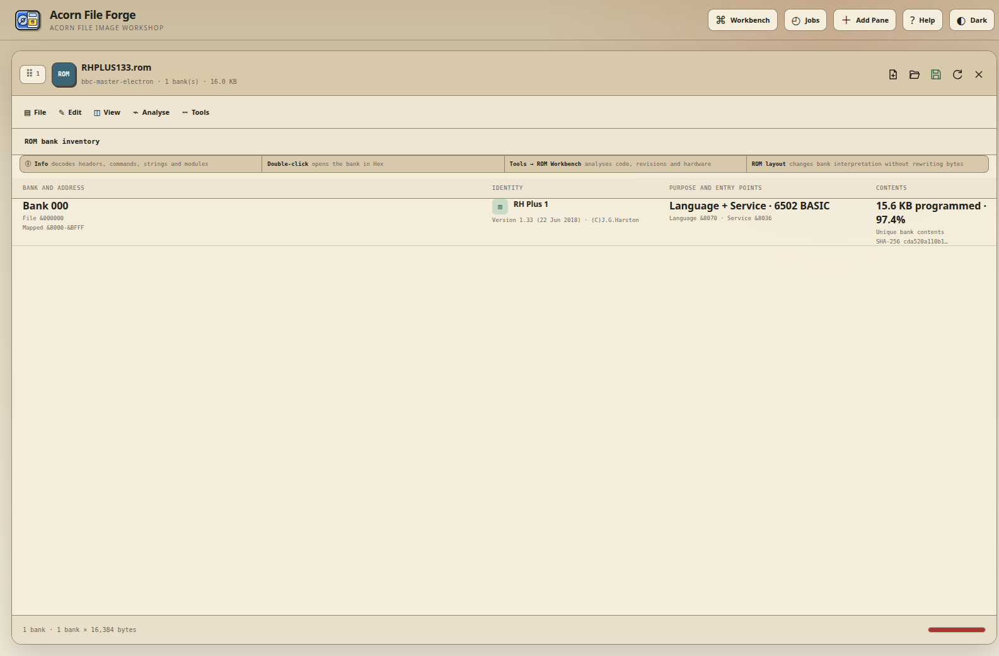

The dedicated [ROM image handbook](docs/ROM-GUIDE.md) contains the complete
field reference, supported layouts, Workbench instructions, physical programmer
transform order, patch safeguards and troubleshooting guide. The summary below
is enough for normal use.

## Working with Acorn ROMFS data ROMs

ROMFS is different from a raw ROM image. It is a real, flat filing system in an
8 KiB or 16 KiB paged ROM. Acorn File Forge recognises it from the catalogue,
opens it with an `RFS` badge, and presents its files through the same editor,
download, drag, copy and paste workflows as disk files.

Choose **Create a blank image → Acorn ROMFS data ROM** to make one. If the
destination pane has a workbench hardware profile, the BBC/Master or Electron
target is preselected. If it cannot be inferred, the dialog asks. The same
dialog always exposes the capacity, filesystem title, version byte and
copyright so nothing hardware-significant is hidden. The 16 KiB portable data
ROM is the general default; choose 8 KiB when the intended device or available
ROM slot requires it.

ROMFS rules and safeguards:

- The catalogue is flat and case-sensitive. Names contain up to ten Latin-1
  characters. Dots and slashes are valid ROMFS filename characters, not
  directories.
- Files retain 32-bit load and execution addresses. Loose exports include a
  matching `.inf` sidecar, and imports use selected `.inf` metadata where
  available.
- The ROMFS `X` access bit means run-only copy protection. The Access controls
  therefore read **Make loadable** and **Mark *RUN-only** instead of pretending
  it is the DFS/ADFS lock bit.
- File header and data CRCs are regenerated after edits. **Tools → Check
  filesystem** reparses the complete block chain and reports CRC failure rather
  than accepting damaged bytes.
- **Tools → ROMFS properties** edits the catalogue title plus the standard
  paged-ROM version and copyright identity. The header checksum is rebuilt.
- Plain, complete images can be edited and are rebuilt in storage order after
  every change, so they do not need compaction.
- Composite ROMs with executable bytes after the filesystem and incomplete
  fragments from a multi-ROM set open read-only. Their files can still be
  viewed, exported and copied elsewhere, but rewriting them could move code or
  invalidate absolute pointers.
- The generated image is a data ROM selected by the compatible ROM filing
  system, commonly with `*ROM`. It is not an autostart language ROM. Test a new
  image in an emulator or spare programmable device before relying on it.

Dragging between ROMFS, DFS and ADFS applies the destination filename rules and
preserves load and execution addresses. Folder imports into ROMFS are flattened
because the format has no directories. A preflight lists any shortened or
colliding names before the image changes.

### Pane and decoded bank information

- A recognised BBC-family header shows its title, version, copyright, language
  and service roles. Rename changes only the allocated header strings. Raw or
  unrecognised banks remain fully editable in the hex editor.
- The main ROM inventory explains each bank before you open another tool. It
  shows the bank number, image offset, BBC mapped window where applicable,
  decoded title, version, copyright, language or service purpose, processor,
  entry vectors, programmed space, duplicate banks and a shortened SHA-256.
  The guidance strip links those facts to Info, Hex, ROM Workbench and layout.
- The ⓘ action opens a decoded-content view with processor and feature flags,
  mapped entry points, known regions, and bounded printable strings. Each
  location can be opened directly in the hex editor. Strings are evidence of
  commands, messages or build information, not invented files.
- The decoded view also lists provided star commands. RISC OS commands come
  from the module's standard help and command keyword table and are marked
  `declared`. BBC, Master and Electron service ROMs have no universal command
  catalogue, so the scanner recognises common token dispatch and address
  dispatch MOS keyword tables. It requires a coherent run of commands and,
  for address tables, a 6502 indexed reference plus valid in-ROM handler
  addresses. Printable `*Command` text alone is deliberately not listed. The
  RH Plus sample, for example, exposes `*ROMS`, `*SRLOAD`, `*SRSAVE`,
  `*UNPLUG` and its other OSCLI table entries while excluding its help-only
  group headings. A `?` beside a command opens its ROM-supplied help or a
  signature reconstructed from the ROM's help tables. The tooltip says whether
  its contents are declared RISC OS help, reconstructed command syntax, or a
  literal line from a shared BBC `*HELP` topic. Hover, keyboard focus and click
  are supported. Table and handler buttons open the relevant ROM bytes in a
  hex editor inside the decoded-information dialog. Closing it reveals the
  same information at its previous scroll position. Hex editing launched from
  a pane menu remains scoped to that pane.
- The same view reports the bank's SHA-256 and CRC-32 fingerprints, entropy,
  distinct byte count, erased-byte percentage, used range, zero and `&FF`
  counts, image programming offset, and any byte-identical banks. Image Health
  checks duplicate banks and disagreements between header role flags and entry
  vectors.
- On an Archimedes or recognised RISC OS extension image, structurally valid
  relocatable-module header candidates show their title, help text, entry
  facilities, SWI information and exact offsets. Candidates stay clearly
  labelled until an enclosing extension-ROM chunk proves their role.
- A standard RISC OS `ExtnROM0` extension-ROM trailer is recognised. Image
  Health reports its checksum if it does not match the image bytes.
- Double-click a bank to open the hex editor at its first byte. Erase fills a
  selected bank with the configured erased value while keeping the image size.
- **File → Insert ROM bank(s)** accepts several files. Exact multiples of the bank
  size are split in order; a file that would need silent truncation is refused.
- Select two or four equal-size ROM files together to concatenate them or
  interleave them as byte-wide chips. Four-chip mode covers the usual
  Archimedes/RISC OS physical ROM arrangement. The save ZIP contains the
  logical working image, the original chip names and reconstructed chip files.
- Cut, Copy, Paste and drag work across ROM images and the normal disk formats
  where the target can represent the bytes. ROM banks do not acquire fake
  directories, lock bits or filesystem compaction controls.
- Save produces the normal timestamped ZIP and technical README. The README
  records bank size, layout, erased value, target family, component order,
  header findings and SHA-256 checksum. It also contains `ROM-project.json`,
  which keeps hardware notes, symbols, comments, regions and emulator test
  results separate from the ROM bytes.

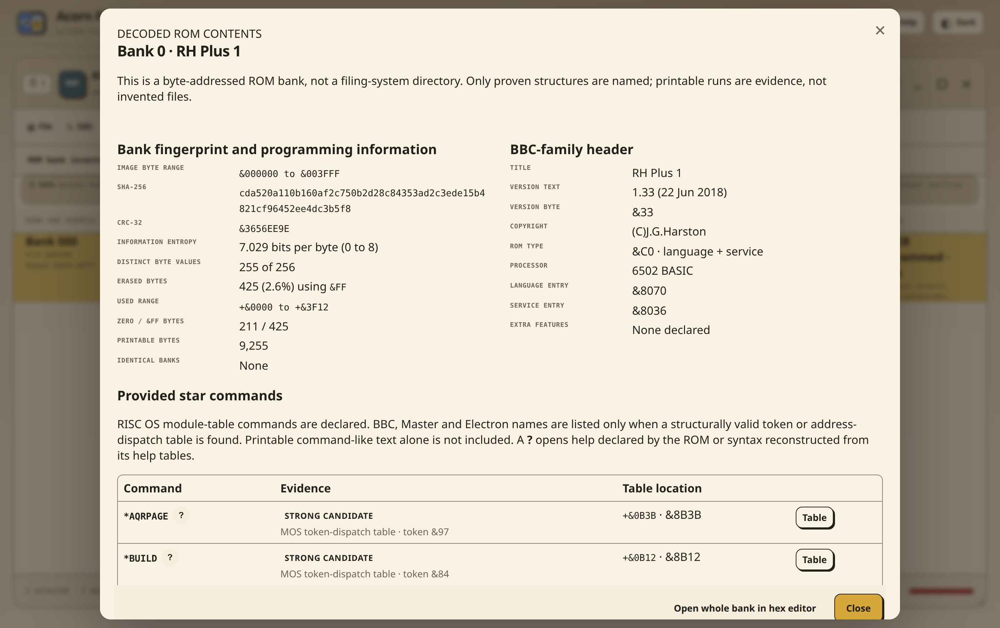

The decoded dialog starts with focus on its heading, so opening it does not
highlight or expand the first command. Use Tab to enter the command table. A
command help tooltip appears on hover or keyboard focus and can be pinned with
a click.

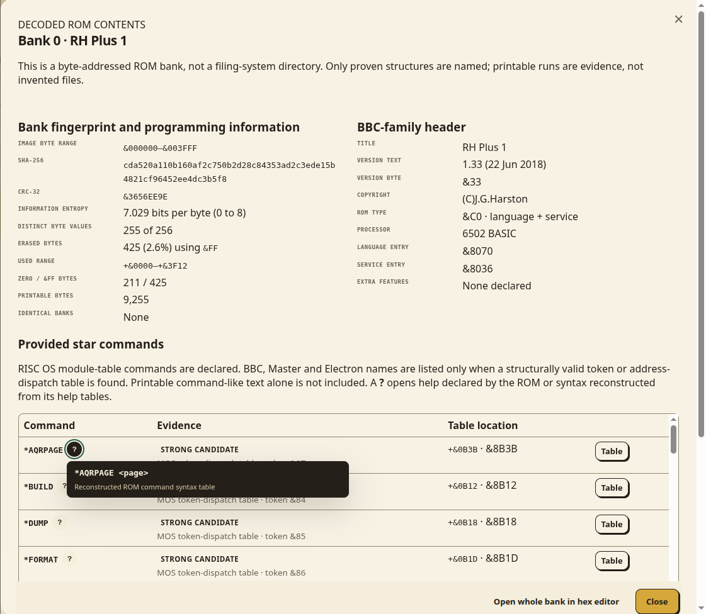

### ROM Workbench

Choose **Tools → ROM Workbench** for the higher-level maintenance tools:

- **Overview** draws the logical bank map, file offsets, physical byte lanes,
  duplicate-bank relationships, fingerprints and structural audit. Proven
  contradictions between header role flags and entry vectors can be aligned
  automatically. A bad standard RISC OS extension-ROM checksum can also be
  rebuilt. Both operations receive an automatic undo checkpoint.
- **Disassembly** decodes NMOS 6502, ARM and 68000 instructions from any bank
  and offset. ARM uses little-endian 32-bit instruction mode and 68000 uses its
  native big-endian mode. Unknown 6502 opcodes remain `EQUB` bytes rather than
  being presented as invented code. Known entry points seed reachable-code
  analysis, branch and call targets receive cross-references, and calls through
  the BBC MOS jump table are labelled with names such as `OSBYTE`, `OSWORD`,
  `OSFILE` and `OSCLI`. Internal 6502 routines are named from proved MOS calls,
  return form, loops and hardware access; ARM and 68000 targets use clear
  `subroutine_`, `loop_`, `dispatch_` and `continue_` roles. Symbols and address regions saved in the project
  metadata are applied to the listing.
- **Compare** compares this ROM with another ROM open in a workbench pane. It
  lists contiguous changed ranges and exports an Acorn File Forge patch. A
  patch records both source and target SHA-256 checksums, so it is rejected if
  the source is the wrong version or the result is not exact. Tick individual
  ranges when only reviewed changes should be included in a selective patch.
- **Build** creates an inert BBC-family service-ROM development scaffold with
  a valid header, descriptive command table and handlers that initially return
  immediately. It can also package host files in the documented `AFFROMFS1`
  data layout. AFFROMFS requires matching service code and is not a filing
  system understood by an unmodified MOS.
- **Programmer** pads or mirrors the image to a power-of-two physical device,
  optionally swaps adjacent bytes or 16-bit words, applies explicit address-line
  swaps, and splits it into one, two or four byte lanes. The resulting ZIP
  includes the chip files and a checksum-bearing programming report.
- **Project** records hardware, socket, research and symbol information without
  modifying the image. **Emulator** reports the managed emulator selected by
  the hardware profile. Direct sideways-ROM attachment remains disabled unless
  the selected machine's exact ROM-slot mapping is known; this avoids silently
  replacing a machine ROM or testing the wrong bank.

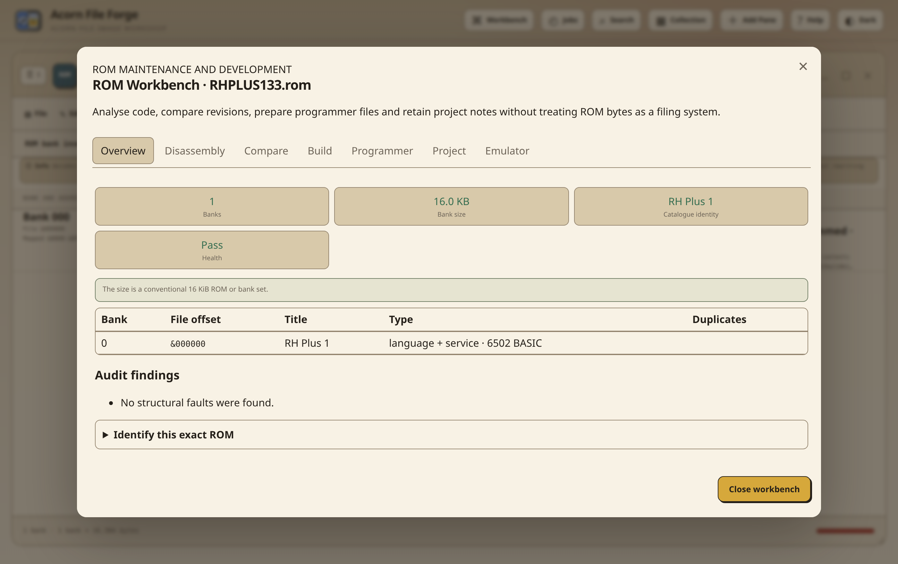

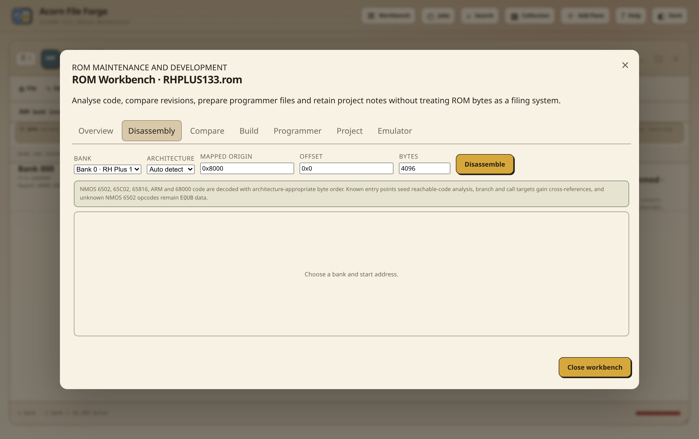

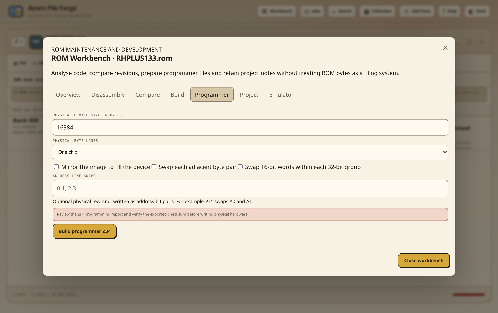

Workbench data falls into three safety classes:

| Class | Examples | Effect on working bytes |
| --- | --- | --- |
| Read-only analysis | Overview, audit, disassembly, compare, identity lookup | None |
| Project metadata | Exact-ROM identity, notes, symbols, regions, emulator results | Stored beside the image, not in ROM bytes |
| Reviewed write | Header repair, checksum repair, patch apply, Build | Automatic checkpoint, explicit confirmation and image revision change |

Programmer export is read-only with respect to the logical working ROM. Its
padding, mirroring, byte swapping, word swapping, address-line swapping and
lane splitting exist only in the downloaded programmer ZIP.

### Identification, saving and safety

Exact known-ROM identification reads `app/rom_catalogue.json`. Catalogue rows
use SHA-256 rather than titles or filenames. This makes the catalogue safe to
extend locally and prevents similar-looking versions from being confused. The
Overview tab can store an identification in an owner-scoped local catalogue,
so later sessions in the same browser recognise the exact dump without sharing
that private record with another user.

Raw ROM edits can make hardware unbootable. Use a checkpoint, keep the original
dump and test a disposable programmed device or emulator before replacing a
known-good ROM.

## Working with MMB

An MMB opens at its slot index, not directly inside slot zero.

- Every slot is shown, including unformatted slots.
- Double-click a formatted slot to browse its embedded DFS disk.
- Use **All disks** to return to the MMB index. The slot you came from remains
  selected.
- Point at a formatted slot to reveal Rename and Eject beside its name. The
  Access column holds its read/write and read-only actions. In a multiple
  selection Rename is hidden, while access changes and Eject apply to the
  selected batch. Ejecting one or several disks also removes every associated
  record from an installed editable Universal or SPI menu. Records remain when
  another formatted slot still provides the same disk title.
- Import several SSD, DSD, and DFS-formatted HFE images in one operation. The
  importer walks forward looking for the next suitable empty slot or empty
  pair.
- Create blank SSD or DSD images and insert them as needed.

Slot edits are first made in an isolated SSD working file, then synchronized
back to the correct 200 KiB region in the MMB.

## MMB menu choices

Any new or existing MMB can install a menu through
**Menu → Create / manage menu**.
Choose the menu type and its reserved empty slot:

- **Games Universal Menu** provides editable title, publisher, launch file,
  action and PAGE records. Its databases can be updated, regenerated and
  previewed by Acorn File Forge.
- **SPI Game Menu** installs the Ray Harper Electron MMFS menu. It stores
  title, publisher and MMB disk title, then selects that disk and executes its
  `!BOOT`. It supports several titles on one compilation disk. The original
  BASIC program describes itself on screen as the `ELECTRON SDI GAME MENU`;
  Acorn File Forge keeps the familiar SPI name in its menu selector.
- **Electron User / Magazine Menu** and **Acorn User Menu** provide their
  original catalogue browsers and databases.
- When another pane contains an MMB with recognised menus, choose the exact
  menu and source slot to copy. Images containing both Universal Menu 4R and
  MMC Desktop 3 expose both choices. A copied MMC Desktop `DISCCAT` catalogue
  is rebuilt for the new MMB rather than retaining stale entries.

Menu titles supplied wholly in capitals are converted to readable title case,
while recognised acronyms, Roman numerals, numeric forms such as `3D`, and
deliberately mixed-case titles are retained. Generated title and publisher text
is fitted to the installed menu's 40-column display, including its `A-`
selection label, so an entry cannot wrap onto the next hardware line. Long
values are shortened at a word boundary where possible.

When inserting a DFS image into MMB, tokenised BASIC loaders are checked for
single-character `#` wildcard references. If exactly one file in the relevant
DFS directory matches, the reference is replaced with its exact catalogue
name. This avoids MMFS variants failing to resolve a loader such as
`CHAIN "BUG#1"` when the disk actually contains `BUG?1`. Ambiguous references
are left untouched rather than guessed.

A new MMB remains menu-free until a menu is explicitly installed. Local sample
images are development and compatibility fixtures, are excluded from Git and
are not presented as built-in user disks. Installing or copying a menu maps MMFS drive 0 to its
reserved slot in the MMB power-on header, so a menu placed somewhere other
than slot 0 still becomes the initial drive-0 disk.

## Universal and SPI Game Menu support

The menu workflow can:

- Install a menu in a chosen empty slot.
- Set the Universal Menu boot PAGE to the current BASIC value, `&E00` for a
  verified paged or sideways-RAM MMFS setup, or `&800` for a verified
  DataCentre/low-PAGE environment. The generated `!BOOT` applies that PAGE
  before chaining `UNIMENU`; arbitrary values are rejected.
- Scan a disk title, catalogue, `!BOOT`, launch command, and PAGE value.
- Derive the default PAGE from the selected launcher in the actual disk image.
  For CHAIN this is the tokenised BASIC program's saved load address; for an
  EXEC loader the boot commands are followed to the BASIC program where
  possible. Old programs with complete BASIC line records but no conventional
  terminator are recognised too. Machine-code launches are marked as not using
  BASIC PAGE. If you replace an image-derived value, Acorn File Forge requires
  an explicit Yes/Cancel confirmation and explains the risk before writing the
  menu.
- Let you review or correct title, publisher, launch file, action, and disk
  title.
- Bulk edit the installed database in a compact CSV-style table. Name,
  publisher, MMB disk, launch file, action and PAGE can all be corrected across
  many rows before one atomic save. Search the table, sort it by name, drag rows
  into manual order, add or remove rows, and clone compilation titles. Launch
  fields expose files from the selected slot catalogue on demand, avoiding a
  slow scan of every disk just to open the editor. SPI rows correctly omit the
  inapplicable launch, action and PAGE fields. Changed records must name one
  unique formatted disk and a file that exists in its DFS catalogue before the
  four database files are replaced together.
- Keep individual disks off-menu.
- Add entries that were skipped earlier.
- Recover inserted disks that have no saved record with **Add missing disks**
  directly from the preview. Creating a game menu in an already populated MMB
  starts the same scan automatically.
- Regenerate every menu entry.
- Rebuild title and publisher indexes.
- Run **Menu → Audit launch PAGE values** against any installed Universal
  Menu. The audit follows every CHAIN or EXEC launcher in its actual MMB slot,
  repairs only provable PAGE differences, converts legacy full-address fields
  to the database's required high-byte encoding, and validates the menu disk.
  RUN, LOAD and machine-code launches are counted separately because BASIC
  PAGE is not part of their hand-off. Anything ambiguous is reported by slot,
  title and reason for manual review instead of being guessed.
- Copy the complete active MMB menu disk with **Menu → Backup menu slot**.
  Choose any empty slot; the copy is labelled `MBACKUP-xxx`, marked read-only,
  excluded from installed-menu detection and omitted from automatic menu
  scans. **Restore menu backup** copies it back over the active menu slot,
  retains the backup, keeps the drive-0 mapping and rolls back if validation
  fails.
- Interpret the installed tokenised BBC BASIC menu program, including its
  screen mode, logical palette, text window, embedded heading/help strings,
  database selection and page size. The preview then renders the real
  `GAMDATA` order using those values and lets you inspect each launch command.
  Programs outside the supported Universal Menu family are labelled as a
  database-only preview instead of being dressed up as an invented hardware
  screen.

SPI Game Menu records deliberately do not contain a launch filename, action or
PAGE. Acorn File Forge therefore asks only for title, publisher and the unique
12-character MMB disk title. It writes three-field `GAMDATA` and `PUBDATA`
records, rebuilds their BBC BASIC binary indexes in 26-entry pages, and shows
the effective disk selection and `!BOOT` hand-off in Preview. The installed
program loads its small `DOEXEC` helper, performs `*DIN 0 <disk-title>`, then
runs the helper to execute the newly selected disk's `!BOOT`.
Adding a second title for the same disk creates another record without
duplicating the disk image.

On an Electron, `PAGE=&E00` is valid only with an MMFS build whose workspace
really lives in sideways RAM, such as the appropriate ESWMMFS or relocating
ZEMMFS build. Do not force ordinary ROM-based EMMFS down from its natural
`PAGE=&1900`; BASIC will overwrite filing-system workspace and typically fail
with corrupted tokens or repeated `GOSUB` text. Tube-hosted execution can also
break software that expects the native Electron memory map. Disable the Tube
for those titles.

Treat the image-derived PAGE as the safe default. Changing it can place BASIC
over MMFS, ADFS, loader or Tube workspace and lead to corrupted tokens, hangs,
random crashes or errors that appear unrelated to the menu. Override it only
for a hardware or filing-system configuration you have verified.

The Universal Menu database stores only PAGE's high byte because its original
BBC BASIC reader reconstructs the address with `EVAL("&"+field+"00")`.
Acorn File Forge therefore displays and edits the clearer complete address
(`&E00`, `&1900`, `&1D00`) but writes `E`, `19` or `1D` to `GAMDATA` and
`PUBDATA`. Older app builds could write the full address into that compact
field, causing the reader to construct values such as `&190000`; rewriting or
regenerating the menu now repairs those records.

The maintained Universal Menu program prints one blank line before entry A.
This centres a normal 26-entry page vertically without adding a blank line to
search-result rendering. Installing, updating or auditing a Universal Menu
applies this program upgrade to both MMB and ADFS copies.

This rule is shared by every Universal Menu writer. It applies equally to an
MMB menu disk and to a menu installed in an ADFS floppy, HDD, HDF, RAW or
BeebSCSI DAT/DSC directory. ADFS menus expose the same **Audit launch PAGE
values** action at the directory containing the menu. It follows that menu's
ADFS paths and launch files, repairs provable values and legacy encodings, then
validates the complete image. Run it separately at each menu root when one HDD
contains several installed menus.

Metadata discovery uses the strongest local evidence first. Existing MMB menu
records are reused before reading a disk again. The importer then considers
TOSEC, Ghostware and similar archive/member filenames, examines the catalogue,
load addresses, `!BOOT` command files and conventional loaders, and maps the
chosen launcher to its copied ADFS name. Only unresolved or ambiguous records
go online. Those searches check the Complete BBC Micro Games Archive first,
then the Internet Archive and itch.io for newer homebrew releases. Multiple
matches are shown for confirmation and do not silently replace reliable local
details.

Metadata lookup is field-aware and stays local for as long as possible:

1. An existing Universal or SPI Game Menu record for an MMB slot is authoritative.
2. The original distribution or ZIP-member filename is parsed for a TOSEC-like
   title, release date, and publisher. This provenance is retained per MMB
   slot and per extracted ADFS directory, including after a container restart.
3. The filesystem is inspected locally. DFS uses its disk title, catalogue,
   load/execute addresses, readable `!BOOT`, and conventional launchers. ADFS
   uses its directory title, files, child directories, `!BOOT`, and launchers.
4. If title or launch metadata remains ambiguous, the Complete BBC Micro Games
   Archive is checked first, followed by the Internet Archive and itch.io for
   archive releases and newer homebrew software.

For a standalone SSD/DSD the host filename and DFS catalogue are therefore the
first useful sources. For MMB, an existing menu record comes first, followed by
the retained source filename and embedded DFS disk. For ADFS, an existing menu
already contains the saved values; newly imported directories use the retained
distribution filename and local directory analysis before an online lookup.

An existing MMB menu record is carried across as a complete record, including
display title, publisher, launch filename, CHAIN/RUN/EXEC/LOAD action, PAGE,
and disk title. Those fields are not replaced by an online match. The copied
directory is still inspected to locate that launch file at its new ADFS path;
if it cannot be found, the original menu values remain visible for manual
review rather than being silently discarded.

Universal Menu stores its global filing-system marker in the first database
record. Acorn File Forge upgrades the installed menu reader and stores the
first record as a combined value such as `ME` for MMB plus EXEC. This preserves
the selected action even when an EXEC `!BOOT` title sorts first. Legacy first
records that name `!BOOT` are recovered as EXEC when the menu is next updated;
they are never presented or rewritten as `CHAIN "!BOOT"`.

Some compilation disks have several Universal Menu records with the same MMB
disk title. Acorn File Forge collects every matching record, resolves each
launcher inside the one copied ADFS directory, and offers every game as a
separate ADFS menu entry. PAGE is represented as the complete hexadecimal
address, so abbreviated values such as `E` and `19` are normalised to `E00`
and `1900`.

Numbered continuation disks are treated differently. When one disk owns the
Universal Menu record and later disks contain only data, the continuation
disks are identified from the existing MMB menu and kept off the ADFS menu
instead of presenting data chunks as launch programs. Their files are still
retained on ADFS. Software that changes physical disks may need a title-specific
conversion before it can run from extracted directories.

Menu metadata is retained after every completed section of a bulk transfer.
If an empty disk, destination conflict, cancellation, or later copy error
pauses the batch, the records collected for disks already copied are carried
into the resumed operation. The final menu therefore represents the whole
successful batch, not only the last uninterrupted section.

Parsed MMB menu records are cached for later copies and refreshed whenever the
application rewrites the menu. SPI records are normalised internally as an
`!BOOT` EXEC launch when software is copied onward to ADFS.

The interpreted preview is deliberately narrower than a complete Electron or
BBC emulator. It executes the installed menu's declarative display path. That
includes the Universal Menu `TXT2SCN` renderer and the SPI menu's tokenised
`GAMECOL` Mode 1 program, palette, heading, function-key legend and three-field
database renderer. It does not run selected software or pretend to reproduce
unsupported machine-code menus. The preview shows the menu program name and
SHA-256 prefix so the screen can be tied to the exact program installed in the
image.

ADFS volumes can have a similar menu. Pick a root directory and each software
directory beneath it is treated like the contents of one disk. Structural
group directories created to satisfy the mounted directory-entry limit, such as
`GAMES1` through `GAMES5`, are detected and kept off-menu. Their contained
`DISC-####` directories become the entries instead. Internal DFS-derived paths
such as `eE` and `eT` are not mistaken for group holders.

The launch file is selected from a dropdown populated from the extracted
files. The complete directory containing that file is stored in `GAMDATA`.
Automatic detection gives `SSDMENU` first priority and always launches it with
`CHAIN`, even when the disk also contains `!BOOT`. Without `SSDMENU`, it checks
a readable `!BOOT`, then familiar loader names including `DISKMENU`, `MENU`,
`LOADER`, `START`, and similar menu-like names. The candidate itself is inspected: readable command files use
`*EXEC`, BBC BASIC programs loaded at `&1900` use `CHAIN`, and other
conventional executable loaders use `RUN`. When several plausible launchers
remain, the choice is left for review in the populated dropdown.
The installed Universal Menu handles an ADFS record by issuing `*DIR` with that
full path before it runs, chains, loads, or executes the selected file, so
grouped and nested software directories launch in their proper context.
Choosing **Keep off-menu** does not require a launch file.

The generated ADFS `!BOOT` first selects the menu root itself, for example
`DIR $.Games`, and then chains `UNIMENU`. The menu program deliberately opens
`GAMDATA`, `GAMINDX`, `PUBDATA`, and `PUBINDX` relative to that current
directory. This works whether `!BOOT` is executed after manually entering the
directory or by its full ADFS path, and avoids accidentally looking for the
databases in the volume root.

Bulk MMB extractions store the original slot title as the ADFS
directory title. This retains useful menu metadata even when generic
`DISC-####` path names are selected.

An installed ADFS directory menu can be reordered from its preview. Choose
name ascending or descending, or drag entries into a manual order, then use
**Save order** to rebuild `GAMDATA` and its index. The publisher database stays
alphabetised, and later additions are appended without discarding a saved
manual order.

File rows keep everyday actions close to the object in DFS, MMB disks and ADFS.
Use the pencil icon to rename a single file or directory, and × to delete the
selection after one confirmation. With several rows selected Rename is hidden,
while Delete removes the full selection in one filesystem operation. The Access
column marks one or several applicable files read/write or read-only. Moving is
handled by drag and drop, so it does not need a separate toolbar command. If a
renamed, moved or deleted ADFS directory or launcher is referenced by an
installed menu, Acorn File Forge rewrites the affected menu path or removes all
obsolete entries and rebuilds its indexes once.

Online matches are always shown for review before anything is written.
Temporary internet failure does not prevent manual metadata entry.
Generic path labels such as `DISC-0184` do not provide a meaningful search
term, so the scanner skips that otherwise slow lookup and asks for local
review. Named ambiguous titles are still checked online.
After adding or regenerating entries, the installed menu preview opens at the
newest entry so the result can be checked immediately.
For an MMB, select **Capture actual menu** in that preview to compare the
database rendering with a bounded capture of the real program. This is useful
for unfamiliar machine-code menus, where the normal preview deliberately shows
database records instead of pretending to interpret code it does not support.

## Archimedes and RISC OS images

Acorn File Forge uses the FileCore and ADFS structure, so directories are
fully traversable. Normal operations work at any level of the hierarchy.
RISC OS filetype, load address, execute address, datestamp, and access metadata
are displayed when present.

The target-hardware choice controls compatibility checks rather than changing
the file extension:

- **Auto / inspect only** identifies and browses the filesystem without adding
  machine-specific repairs.
- **Electron Plus 3** and **BBC / Master** apply the normal 8-bit old-ADFS
  directory checks.
- **BeebSCSI** is a separate Electron/BBC/Master target and requires a matched
  DAT and DSC pair.
- **Archimedes / RISC OS** selects the 32-bit target without applying old-ADFS
  hardware repairs.

To reorganise one ADFS image, drag a row onto a directory row. Multiple
selected rows move together. You can also show the same image in multiple
panes, navigate them to different directories, and drag between them. Every
pane showing that image refreshes after the move, including any pane whose
current path moved with its parent directory.

The application accepts virtual hard-drive images and byte-for-byte dumps of
physical drives. "Physical drive" means an image captured from the device. A
web browser does not receive direct access to host paths such as `/dev/sdb`,
and the Docker container is not granted raw-device access.

This separation is intentional. It prevents a typo in a web request from
writing directly to a real disk. If a finished raw image must be restored to
hardware, do that outside Acorn File Forge with a trusted imaging tool and
verify the target device carefully.

### FileCore compatibility note

The released Oaknut 12.15.1 engine safely edits ADFS S, M, L and D, New-map E,
F and G, and the E+, F+ and G+ Big-directory variants. The app creates all ten
standard floppy formats, detects their on-disc structures, preserves Acorn
metadata, compacts allocation and runs the filesystem validator. Standard New
directories allow 77 entries. Big directories allow names up to 255 characters
and have a capacity-dependent entry count, so the UI does not impose the old
10-character and 47-entry limits on them.

The DSC is mandatory when editing an old-map BeebSCSI DAT. It contains the physical
drive geometry that is not safely recoverable from the DAT alone. If only one
half of the pair is selected, Acorn File Forge retains and prefills it in a
paired upload dialog, leaving only the missing companion to choose.
Descriptor-less old-map DAT sessions remain browseable but all writes are blocked.
Reopen the original DAT and DSC together to edit it. New-map DAT images carry
the filesystem geometry in their FileCore disc record and can be edited without
a DSC sidecar.

The DAT length follows the old-format ADFS map, while the DSC describes the
slightly larger device geometry presented by BeebSCSI. This distinction matters
on physical hardware. The official Quickstart pair has an ADFS extent of
536,719,360 bytes and a DSC geometry of 536,752,128 bytes. Acorn File Forge keeps
that layout. If an older version of the app added an all-zero geometry tail, the
tail is removed automatically without moving or rewriting filesystem content.
Data beyond the map is never removed when any byte in that area is non-zero.
Likewise, a DAT shorter than its ADFS extent is not padded because real
filesystem data may be missing.

Acorn File Forge no longer carries an Oaknut patch. The Docker build imports and
checks the released D/E/E+/F/F+/G/G+ API before producing the runtime image. An
`.adf` suffix remains only a hint: recognition comes from the allocation map,
disc record and directory structures. See the
[Oaknut FileCore integration notes](docs/OAKNUT-FILECORE-SUPPORT.md).

### HDF and RAW creation detail

New HDF and RAW images are created from an explicit capacity. Existing RPCEmu
and Arculator HDF/HD4 images with logical disc address zero at offset `0x200`
are detected from their FileCore structures and retain that layout while edited.

## UEF tapes

UEF support reconstructs standard Acorn cassette filing-system blocks.

- Compressed and uncompressed UEF files are accepted.
- File names, load addresses, execute addresses, and block completeness are
  shown.
- Reconstructed files can be exported or dragged to another image.
- **Tools → UEF tape project** inventories the header and every physical chunk,
  including control and unknown chunks, with offsets, lengths and SHA-256
  fingerprints.
- Complete standard-block members are editable only when their reconstructed
  byte length remains unchanged. Save opens a structural comparison before it
  touches the image. Only the selected data bytes and their cassette block CRCs
  may differ; raw or gzip-compressed form and all other chunks are preserved.
- A complete tape can be converted to SSD or DSD. Conversion analyses each
  tokenised BASIC program, replaces cassette-order calls such as an empty
  `*/` or `CHAIN ""` with the final DFS filename, and updates references when
  a long name is shortened.
- Control-only or empty cassette catalogue names receive stable inferred names
  instead of appearing as `_` or `_1`.
- Converted disks receive DFS boot option 3 and receive `!BOOT` only when the
  proposed loader is safe to start independently. Tokenised BASIC is also
  checked for file-channel operations inherited from the cassette loader. If
  it uses a channel without opening one itself, automatic `!BOOT` generation
  is suppressed and the image explains that a direct launch would raise BASIC
  error 222 (`Channel`). Binary, incomplete, protected or otherwise uncertain
  loaders likewise carry a visible warning rather than being presented as a
  guaranteed working conversion.
- When a UEF, SSD, DSD, HFE, or MMB disk is extracted into ADFS, binary loaders are
  checked for DFS-only OSCLI abbreviations such as `R.` and `L.`. These can be
  ambiguous under ADFS because it adds commands including RENAME, REMOVE,
  LCAT, LEX, and LIB. If the loader uses a provable immediate OSCLI pointer and
  its address range has safe room, Acorn File Forge appends full `RUN` or
  `LOAD` commands and redirects only those pointers. It leaves uncertain code
  unchanged rather than risking a blind binary patch. Analysis begins with
  conventional boot scripts and follows their directly named launch target.
  Unrelated documentation, magazine text and game data are not scanned as
  loaders merely because their bytes happen to contain `R.` or `L.`. Every
  successful change is reported as a persistent image warning. Multiple
  unresolved commands in one reachable loader are condensed into one warning.
- ADFS floppy-to-HDD imports receive the same guarded loader pass. Some ADF
  releases still contain DFS-style `R.`, `L.`, or `LO.` commands even though
  their files are stored on ADFS. Textual `!BOOT`, `MENU`, `LOADER`, `START`,
  and `GO` scripts are expanded to unambiguous `RUN` and `LOAD` commands.
  Reachable tokenised BASIC loaders are also checked for rooted references such
  as `$.LOADER`. When that exact file is present in the newly extracted
  directory, the reference is made relative and the BASIC line length is
  rebuilt. This lets software moved below the HDD root find its own files while
  preserving genuine dependencies on files elsewhere in the volume.
  Proven machine-code OSCLI pointers are repaired by the same safe binary
  process. Reimport a directory created by an older release to apply these
  compatibility changes.

Cycle-level encodings, deliberate read errors, protection schemes, and other
non-standard chunks cannot always be represented as ordinary files. The
application reports those chunks and marks incomplete recovered files rather
than silently pretending the conversion was perfect.

## Saving and recovery

**Save Image** first validates and finalises the current working image, then starts
the download in an isolated browser target. A validation or network error is
reported inside Acorn File Forge and cannot replace the application with a raw
JSON error page. A successful preparation clears the pane's orange changed dot;
a failed preparation leaves it in place so unsaved work cannot be mistaken for
a completed save.

- Every format is returned as a timestamped ZIP named
  `<image-name>-YYYYMMDD-HHMMSS.zip`, so repeated saves do not silently reuse
  the old `-edited` filename.
- Every ZIP includes a detailed `README.md` with the format, target
  hardware, byte size, SHA-256 checksum, warnings, usage notes and a filesystem
  catalogue. MMB reports list all 511 slots, including empty ones, access state
  and the files inside each formatted DFS disk.
- A DAT image with a DSC descriptor keeps both files together below the
  `BeebSCSI0/` directory in the ZIP. The README remains at the archive root.
- Sparse BeebSCSI DAT archives use fast DEFLATE compression. Free zero-filled
  capacity therefore does not need to cross the network verbatim; the extracted
  DAT still has its original logical size and exact SHA-256 checksum.
- ZIPs are built with bounded memory and real byte progress before the browser
  handoff. The completed archive is served as an ordinary file with a known
  length, so "ready" means no hidden checksum or ZIP-building work remains.
- Opening or creating ADFS media offers a target-hardware profile. The 8-bit
  profiles validate matching old `Hugo` directory headers, footers, parent
  links and sequence copies. A saved BeebSCSI volume also receives a new
  old-map disc ID and checksum so ADFS does not confuse the edited filesystem
  with the original cached volume.
- Saving an MMB returns the complete MMB, including all slots.
- Saving an edited HFE v1 first writes against the original track layout, then
  decodes and byte-compares the resulting sectors. A mismatch blocks the
  download. Read-only HFE v2/v3 and damaged images download unchanged.

Session metadata is stored beside each working image. If the Gunicorn worker
restarts, the application can reopen a valid session from disk. On either empty
pane, choose **Recover previous session** to list retained working copies newest
first. Recovery preserves completed edits after a refresh, accidental browser
navigation, interrupted download, or container restart. Removing the Docker
volume removes those sessions.

Recovery is private to the owner that opened or created the image. In the web
edition the server issues a random, year-long `HttpOnly`, `SameSite=Strict`
ownership cookie and mirrors the same opaque ID in origin-scoped browser
storage. Either copy can restore the other after a browser update or container
restart. The desktop edition keeps a stable owner ID in
`$XDG_CONFIG_HOME/acorn-file-forge/owner-id`, or the corresponding directory
under `~/.config`, with mode `0600`. Recovery listings, direct image API access
and deletion always enforce that owner match. There is no shared global session
browser. Clearing both site cookies and site storage breaks web recovery;
deleting the desktop owner ID breaks desktop recovery. Download important work
before clearing either identity.

Closing a work pane now detaches the image without deleting its server-side
working copy. Reopen it through **Recover previous session**. Permanent removal
is deliberately confined to the recovery dialog's confirmed **Clear** actions.

The browser remembers every currently displayed work pane, its position, size,
stacking state and order. A normal refresh reopens each image and returns to
the same MMB slot, DFS side or ADFS directory. Closing a pane removes it from
automatic reopening while keeping its recovery copy.
On the first refresh after upgrading from a version without workspace memory,
the newest working session owned by that browser is reopened automatically.
This one-time bridge stops the upgrade itself returning active work to the
empty start screen.

Use **Recover previous session** to remove individual retained sessions or clear
the previous sessions shown there. Images currently open in any pane are
omitted from those clearing controls. Clearing removes only Docker-side working
copies, never the source files selected from the host.

Each recovered session includes its named checkpoints and automatic undo
history. Recovery ownership therefore protects both the active working image
and every snapshot beneath it.

## Built-in help

Use **Help** in the top-right corner for the illustrated handbook. It covers
the expandable freeform pane workspace, window snapping, undo and named
checkpoints, all supported formats, MMB blank disks and protection,
drag and drop, directory traversal, Universal Menus, UEF conversion,
HFE safety and conversion, BeebSCSI pairing, long-operation recovery, keyboard
selection, saving, and safety. The guide uses screenshots from the current
interface and works in light or dark mode.

Browser state is not a substitute for saving. Download important work before
upgrading the container, deleting its volume, or cleaning Docker storage.

The in-app handbook and this README describe the same current workflows. If
they disagree with the controls in a newer build, please report the mismatch
in the [project repository](https://github.com/peteclarke-del/AcornFileForge).

## Limits and practical considerations

- The default upload limit is 8 GiB. Set `ACORN_MAX_UPLOAD_GIB` in
  `docker-compose.yml` to change it.
- A working image needs roughly its own size again in the Docker volume.
  Extraction and conversion may need additional temporary space. HFE sessions
  retain the original container, decoded sectors, and a verified encoded copy
  while saving.
- Large hard-drive uploads and recursive copies can take time. Keep the page
  open while the progress overlay is visible.
- A failed long operation replaces the progress view with a foreground error
  screen. It shows the completed count and last reported path. **Back / retry**
  returns to the original operation and completed MMB slots are skipped.
- Read-only requests retry brief connection failures automatically. ADFS menu
  writes also retry safely because matching directory entries replace one
  another and concurrent menu rebuilds are serialised per image.
- MMB slot extraction mounts the ADFS destination once for a complete batch.
  Common DFS metadata is written with two catalogue updates instead of four.
- Grouped ADFS menu scans also use one open destination mount. Holder
  directories are expanded in memory instead of launching one filesystem
  process for every contained disk.
- Complete DFS/ADFS directory extraction uses one recursive engine invocation,
  rather than starting a process for every top-level object.
- Menu database rebuilds write all four title/publisher files through one
  mounted image, while menu support files are installed with one source and
  destination mount. In a local development benchmark, a three-entry ADFS menu
  creation fell from about 17.8 seconds to 0.5 seconds, and a reorder fell
  from about 8.3 seconds to about 2.7 seconds.
- Local source-image benchmarks use clone or kernel-copy paths where available.
  In the 512 MiB DAT test this reduced open time from about 4.9 to 4.5
  seconds; storage speed remains the dominant cost.
- Individual files use disk-backed responses. Complete image ZIPs are built
  with bounded memory while the foreground progress bar tracks checksum and
  archive bytes. Only then is the known-length archive handed to the browser.
- Open ADFS working images use a trusted, direct memory-mapped mount after the
  upload has been identified. Changing directory therefore reads only the
  requested catalogue and returns its free-space figure in the same request.
  It does not copy or re-identify a complete DAT, HDF or RAW file on every
  click.
- SSD, DSD, ADFS and MMB transfers into ADFS keep one destination mount open
  for the complete batch. Files, metadata and loader checks are applied before
  that mount is released instead of reopening a large hard-drive image for
  every file or phase.
- Mutations to the same image are locked and run in sequence.
- The `disc` subprocess timeout is 240 seconds. Gunicorn allows requests for
  up to 300 seconds.
- Acorn filenames are matched case-insensitively. The application preserves
  the spelling stored in the image.
- One canonical filename policy is used by browser uploads, native path opens,
  clipboard operations, drag and drop, Online Library imports and dry-runs.
  DFS leaves allow seven Latin-1 characters, MMB disk titles allow twelve,
  ROMFS leaves allow ten, and ADFS uses the detected directory limit: normally
  ten, or up to 255 for FileCore Big directories.
- Leading or trailing whitespace, control characters, path syntax and names
  that cannot be represented in Latin-1 are rejected at the API boundary. The
  compatibility review can propose NFKC-normalised replacements, underscores
  and safe truncation before the first write. Collision checks are
  case-insensitive and scoped to the destination parent, so identical leaf
  names in different directories do not conflict. Duplicate MMB disk titles
  remain valid because slot identity is independent of title.
- Compact is important for old-map ADFS and DFS. New-map media would not need
  the same contiguous-free-space maintenance. Released Oaknut support provides
  writable FileCore D/E/E+/F/F+/G/G+ layouts where the detected container and
  directory format can be preserved safely.

## Configuration

The Compose defaults are:

```yaml
services:
  acorn-file-forge:
    image: acorn-file-forge:latest
    container_name: acorn-file-forge
    ports:
      - "8666:8666"
      - "8668:8668"
    environment:
      ACORN_FILE_FORGE_WORK_DIR: /app/work
      ACORN_MAX_UPLOAD_GIB: "8"
    volumes:
      - acorn-file-forge-work:/app/work
    restart: unless-stopped
volumes:
  acorn-file-forge-work:
    name: acorn-file-forge-work
networks:
  default:
    name: acorn-file-forge-network
```

`ACORN_FILE_FORGE_WORK_DIR` selects the private server-side working directory.
The Compose service, image, container, volume and network all use explicit
Acorn File Forge names, so they remain consistent regardless of the checkout
directory name.

## Architecture

```text
Browser
  dynamic panes, dialogs, HTML drag and drop
                    |
                    | JSON and multipart HTTP
                    v
Flask API
  images | files | MMB slots | menus | catalogue | analysis | jobs
                    |
                    v
Disk service
  session copies | locking | MMB adapter | UEF parser | HFE safety
             |                              |
             v                              v
      Oaknut Disc                      HxC engine
  DFS | ADFS | FileCore          HFE tracks | sector conversion
```

The application runs one Gunicorn worker with eight threads. A single worker
keeps the in-memory session cache coherent, while per-image locks allow safe
parallel reads and prevent overlapping writes to the same image.

Backend routes are split by responsibility:

- `app/wsgi.py` is the Gunicorn composition root. It creates the production
  service without making route modules depend on process startup.
- `app/routes/images.py` handles opening, creating, saving, conversion, and
  compaction.
- `app/routes/files.py` handles tree browsing, file operations, extraction,
  and cross-image transfers.
- `app/routes/mmb.py` handles slots and multi-image insertion.
- `app/routes/menus.py` handles MMB and ADFS menu maintenance.
- `app/routes/catalog.py` handles Online Library search, source settings, and
  installation.
- `app/routes/tools.py` handles health checks, manifests, duplicate analysis,
  file inspection, editor projects, BASIC verification, disassembly, emulator
  hand-off and dependency reports.
- `app/routes/effects.py` lets each image-changing route declare its own undo
  checkpoint reason and target. The request boundary reads this metadata, so a
  new write route cannot depend on a separate endpoint-name table remaining in
  sync.
- `app/image_session.py` defines the shared session model and ownership context used by disk, checkpoint, operation and download services.
- `app/session_state.py` owns durable session metadata and warning compaction policy.
- `app/disk_service.py` coordinates image operations and calls the disk engine.
- `app/session_disk_service.py` owns private session persistence, ownership, recovery, checkpoints and summaries.
- `app/filesystem_disk_service.py` owns trusted ADFS and ROMFS mounts plus ROMFS properties.
- `app/adfs_install_service.py` owns installed-software discovery, dry-run audits and deterministic loader repairs for ADFS hard disks.
- `app/disk_tools.py` owns Oaknut and HxC process execution, timeout handling,
  JSON decoding and user-facing engine error cleanup. `DiskService` retains
  compatibility wrappers so established callers and tests remain stable.
- `app/beebscsi_geometry.py` owns BeebSCSI descriptor and old-map geometry calculations.
- `app/filename_policy.py` is the canonical filesystem name policy shared by
  validation, import planning and mutation services.
- `app/desktop_state.py` validates and atomically stores the Linux desktop
  workspace, profile, collection and editor state in its private XDG file.
- `app/mmb_layout.py` owns MMB header, record, slot and image offset calculations.
- `app/mmb_disk_service.py` owns sequential MMB slot catalogue reads and menu
  signature searches. It is composed into `DiskService` as a focused mixin so
  callers keep one stable image API.
- `app/rom_disk_service.py` owns raw ROM bank inspection, layout, movement,
  replacement, physical-component export and persistent ROM/editor projects.
- `app/rom_components.py` validates physical ROM component ordering,
  interleaving and the 64 MiB combined-image bound.
- `app/tape_disk_service.py` owns cached UEF access and UEF-to-DFS conversion,
  proof-gated same-length tape-member rebuilds, generated boot files, filename
  allocation and loader rewrites. It
  is another focused `DiskService` mixin rather than a second service facade.
- `app/menu_service.py` coordinates menu analysis, mutation and installation.
- `app/menu/analysis.py`, `app/menu/adfs.py` and `app/menu/mmb.py` provide the
  smaller domain APIs used by routes and analysis code. `app/menu/mmb_discovery.py` owns MMB menu signatures and discovery without routing callers back through the compatibility module.
- `app/adfs_menu_discovery.py` owns holder-directory recognition and the
  single-mount ADFS catalogue view used for fast menu scans.
- `app/menu_records.py` parses, validates and serialises Universal, SPI and ADFS menu database records.
- `app/metadata_lookup.py` extracts distribution metadata and performs optional online enrichment.
- `app/catalog_service.py` runs the configurable catalogue pipeline and retains
  short-lived install records.
- `app/checkpoints.py` and `app/operations.py` own undo snapshots and persistent
  long-running job records.
- `app/download_archive.py` finalises, checksums, documents and builds complete
  timestamped ZIP downloads with progress reporting.
- `app/analysis_service.py` builds health, manifest, duplicate, inspection, and
  loader-dependency reports.
- `app/image_diff.py` assigns filesystem-aware manifest identities, produces
  deterministic logical fingerprints and classifies cross-image content and
  metadata changes without coupling that work to HTTP or browser state.
- `app/workflow_recipe.py` proves completed GUI workflows by replaying a
  guarded patch from the earliest retained base, comparing byte-exact saved
  outputs and packaging the versioned recipe, patch and rebuild guide.
- `app/content_kind.py` owns bounded content classification and BASIC, script,
  text, binary and UEF recognition.
- `app/archive_browser.py` owns safe UEF and compressed archive traversal,
  path validation, proof-gated member replacement and expansion limits. It
  rejects encrypted or oversized inventories and bounds content sniffing while
  retaining file-type recognition for ordinary collections.
- `app/fat_media.py` builds deterministic, unprivileged FAT16 cards for the
  complete-MMB Pi1MHz/MMFS emulator adapter.
- `app/emulator_evidence.py` owns bounded private-display capture, input
  evidence and reproducible screen fingerprints.
- `app/file_editor.py` owns editable-file inspection, checked source writes,
  BASIC round trips, byte ranges and annotated file disassembly.
- `app/editor_project.py` validates and bounds per-file notes, symbols,
  comments, regions, bookmarks, history and emulator results.
- `app/rom_workbench.py` owns raw ROM decoding, 6502/ARM/68000 disassembly,
  guarded patches, builds, programmer transforms and ROM project metadata.
- `app/checksum.py` provides the shared byte-payload and sparse-aware image checksum implementations.
- `app/uef.py` parses cassette blocks.
- `app/hfe.py` validates HFE headers and classifies HFE versions safely.

Frontend format declarations live in `app/static/formats.js`, and backend
extension declarations live in `app/formats.py`. This keeps accepted
Archimedes and raw-image names in one place on each side of the API.

Frontend behaviour is split by responsibility. `app/static/core.js` contains
shared request and formatting primitives, `workspace.js` owns pane state and
selection paths, `file-visuals.js` classifies entries for consistent icons,
and `import-planning.js` owns target naming, host metadata and DFS packing.
`pane-view.js` owns format, breadcrumb and capacity presentation,
`transfer-planning.js` owns directory-transfer allocation, and
`safety-dialogs.js` owns destructive PAGE override confirmation.
`editor-workspace.js` owns bounded editor-tab persistence and restoration.
`workspace-persistence.js` owns open-pane recovery, while `operation-ui.js`
owns guarded actions and persistent job progress. Storage validation, recovery
and operation polling therefore have one implementation each instead of being
repeated through the pane controller.
`help.js` owns the in-app handbook and its topic navigation.
`hex-editor.js` owns raw fixed-range editing, `code-editor.js` owns language
intelligence and source presentation, and `app.js` coordinates panes and
workflows. The content classifier remains a
backend authority so a filename or browser hint cannot bypass filesystem-aware
validation.

The frontend palette lives entirely in `app/static/theme.css`. Its light and
dark sections define semantic tokens for surfaces, text, state, media icons,
dialogs, progress and the hex editor. `app/static/styles.css` consumes those
tokens and contains no palette-specific colour literals. This boundary keeps
visual redesigns small and makes contrast review repeatable.

## Development checks

Local development media belongs in `samples/`, which is ignored by Git, source
archives and the Docker build context. Tests that need optional real-world
fixtures should skip cleanly when those files are not present.

Generated test images belong in `output/`. That directory is also excluded
from Git and source archives so local build artefacts are never published with
the application source.

Run the Python regression tests:

```bash
python3 -m unittest discover -s tests -v
```

Run the generated-media performance profile and retain its JSON for comparison:

```bash
python3 -m tools.benchmark_media --profile quick --output output/benchmark-quick.json
```

Use `--profile full` for a release candidate. Both profiles generate all working media inside a temporary directory and do not read private samples.

Check Python and JavaScript syntax:

```bash
python3 -m py_compile app/*.py app/routes/*.py
node --check app/static/formats.js
node --check app/static/core.js
node --check app/static/app.js
```

Run the standalone editor language-engine regressions:

```bash
node tests/run_js_tests.js
```

Run the permanent browser regression against the service on port 8666:

```bash
npm install
npx playwright install chromium
npm run test:browser
```

Set `ACORN_FILE_FORGE_URL` when the service is listening elsewhere. The browser
suite checks editor menu transfer, command selection and outside-click
dismissal. It also verifies the dynamic pane lifecycle, pane window management
guard and close/re-enable behaviour in a real Chromium page. Its generated
image flow creates an MMB, inserts a blank SSD, verifies the automatic
checkpoint, performs undo, prepares a timestamped save and downloads the ZIP.
The workspace analysis flow opens two generated filesystems, checks the compact
empty search and comparison layouts, searches both, compares their logical
manifests, applies a guarded patch, rejects its stale reuse, enables JSON export
and checks that populated result dialogs remain within the browser viewport.
No private sample media is required.

`.github/workflows/ci.yml` runs the Python, JavaScript and Chromium suites on
each pull request. A separate Buildx matrix builds `linux/amd64`,
`linux/arm64` and 32-bit `linux/arm/v7`, catching dependency or Dockerfile
regressions that would stop a Raspberry Pi installation even when the x86
build remains healthy.

See [Installing Acorn File Forge](docs/INSTALLATION.md) for complete desktop and Raspberry Pi instructions.

Check the running service:

```bash
curl http://localhost:8666/api/health
```

A healthy response looks like:

```json
{"engine":"oaknut","status":"ok","version":"1.0.0-rc.2"}
```

## Main dependencies

Acorn File Forge source is licensed under the [MIT License](LICENSE). Runtime
components, firmware and user media retain separate terms. Review
[THIRD_PARTY_NOTICES.md](THIRD_PARTY_NOTICES.md) before redistributing a source
archive, container image or native package.

- Python 3.14 in the container, or a compatible Python 3 release for the native application
- Flask 3.1
- Gunicorn 26
- Oaknut Disc, ADFS and ROMFS 12.15.1, including writable FileCore
  S/M/L/D/E/E+/F/F+/G/G+ and hard-disk support
- HxC Floppy Emulator command-line engine 2.16.15.2, compiled from a pinned
  upstream revision during the Docker build
- Docker or Docker Compose

Oaknut provides the filesystem implementation. Acorn File Forge adds the web
workspace, safe working copies, MMB handling, UEF reconstruction, verified HFE
conversion, metadata review, menu generation, and format-aware drag and drop.

The Dockerfile is multi-architecture. It builds on `amd64`, `arm64` and
32-bit Raspberry Pi Linux without assuming that PyPI provides a binary package
for the host. Capstone is compiled into a staged Python installation when the
architecture has no published package. Copying that verified installation,
rather than a locally architecture-tagged wheel, avoids a second compatibility
decision after the native build has succeeded. The compiler, `make` and
development headers are not copied into the final application image.

The first Docker build compiles HxC, Elkulator and B-em, and may also compile
Capstone on 32-bit Raspberry Pi systems. It therefore takes longer than an
ordinary application-only build. Docker caches those builder layers, so later
source and documentation rebuilds are much quicker. A Pi with limited memory
may take several minutes while those independent stages are active. That is
normal as long as the build continues to print progress.

If an earlier build stopped while installing Capstone, pull the current branch
and rebuild the affected layers:

```bash
git pull
docker compose build --pull acorn-file-forge
docker compose up -d
```

The key diagnostics in older failures are `make: command not found` beneath
`Building wheel for capstone`, or `No matching distribution found for
capstone` after that wheel was built. The current Dockerfile handles the source
build and transfers the verified installed package without relying on an ARM
wheel tag. Installing development packages on the Raspberry Pi host does not
fix an older Dockerfile because pip is running inside the container build.
