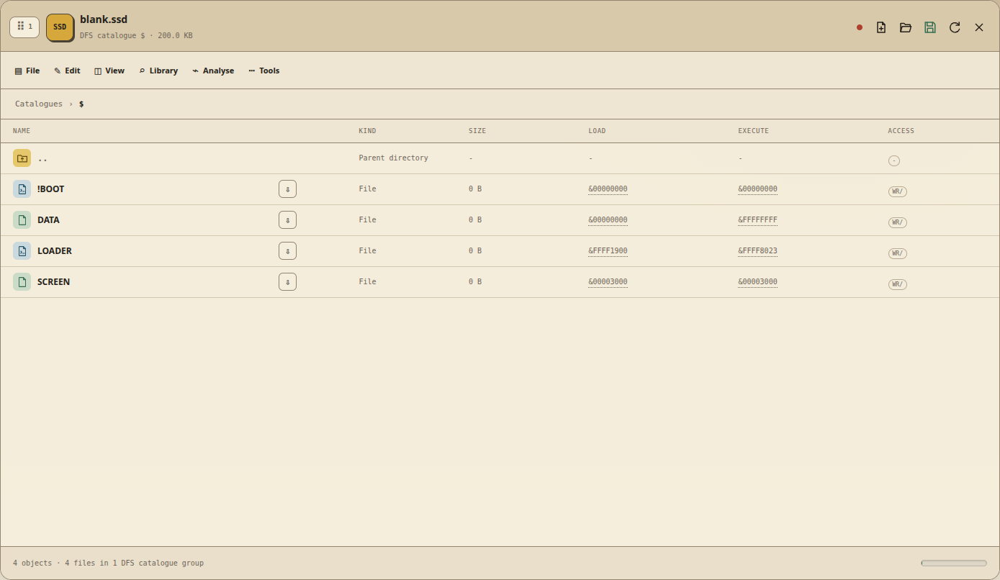

# Acorn file catalogue metadata

Acorn files are more than a filename and a byte stream. The catalogue can also
record a load address, an execution address and access flags. Later FileCore
formats can use the same 32-bit words to encode a RISC OS filetype and
timestamp. These values are part of the file's identity and often determine
whether old software loads, runs or is recognised by another Acorn system.

Acorn File Forge displays the two address words at file level and preserves
them during supported copies, imports, exports and editor saves. It never
derives an address merely because the bytes resemble BASIC or machine code.



## Where addresses are available

| Source | Display | Edit | Notes |
| --- | --- | --- | --- |
| DFS SSD and DSD | Yes | Yes | Includes every A-Z catalogue prefix and both DSD sides. |
| Disk opened from an MMB slot | Yes | Yes | The address belongs to the file inside the slot's DFS image, not to the MMB slot record. |
| ADFS and FileCore floppy images | Yes | Yes when the detected layout is writable | Directories are excluded because they do not have file load and execution semantics. |
| BeebSCSI DAT with matching DSC | Yes | Yes | Uses the same ADFS catalogue operation while retaining BeebSCSI geometry and map safety. |
| ROMFS data ROM | Yes | Yes | The ROMFS catalogue record is changed without altering the file payload. |
| UEF and supported archive members | Yes when metadata exists | Address words are read-only in the hierarchy | UEF blocks, SparkFS extra fields and companion `.inf` files can supply the words. A proven UEF payload may be edited at the same length, but its catalogue address words are preserved. Extract into writable media to change those words. |
| Raw ROM banks | Not applicable | Not applicable | A sideways ROM is decoded as banks and structures, not presented as a conventional file catalogue. |
| Directories and virtual DFS catalogue groups | Not applicable | Not applicable | These rows organise files and do not carry executable file metadata. |

The two columns contain full words such as `&00001900` or `&FFFF1900`.
`&00000000` is a real stored value and is not automatically faulty. Scripts,
data files and BASIC programs loaded through filing-system-aware commands may
not need a machine-code load or entry address.

## DFS address representation

DFS stores a compact address representation in its catalogue. A conventional
host-side `.inf` record normally sign-extends addresses in the `FFxxxx` range
to a full word. Acorn File Forge follows that convention, so a packed DFS value
is displayed and exported as `&FFFF1900`, not as the misleading positive value
`&00FF1900`.

The app translates back to the filesystem's native representation when the
catalogue is saved. It does not modify the file payload during this conversion.

## FileCore and RISC OS words

Classic ADFS software can use the words as literal load and execution
addresses. RISC OS-style FileCore entries can encode a filetype and timestamp
inside them instead. Changing either word directly can therefore change or
destroy that higher-level meaning even when the new hexadecimal value is
syntactically valid.

The address dialog detects entries carrying RISC OS-style metadata and adds a
specific warning. Prefer the original catalogue values, the original archive's
SparkFS fields or a trusted metadata sidecar. Use a filetype-aware operation
when the intention is to change only a RISC OS filetype.

## Editing an address

1. Open the disk or data ROM and navigate to the file.
2. Read the separate **Load** and **Execute** columns.
3. Select either value. Both words are always reviewed together.
4. Enter one to eight hexadecimal digits. An `&` or `0x` prefix is optional.
5. Read the warning and select **I understand, change addresses** only when the
   source values are known.
6. Refresh or reopen the image if an independent catalogue check is required.


The operation creates the normal image undo point, updates only catalogue
metadata and marks the image as changed. It does not rewrite the file's bytes.
An invalid word, missing file, directory target, read-only image or unsupported
filesystem is rejected before any mutation.

## Import metadata priority

An image-to-image copy reads the source filesystem catalogue. A loose host file
does not normally retain Acorn metadata, so imports use reliable evidence in
this order:

1. the source Acorn filesystem or decoded UEF member;
2. a matching `.inf` sidecar selected with the file;
3. SparkFS metadata in a ZIP member;
4. a supported `name,load-exec` host filename convention;
5. neutral zero values when no trustworthy source exists.

Batch imports apply that decision separately to every file. **Apply to all
remaining** accepts each file's own detected values and does not reuse the
first file's addresses across the batch.

## Target filenames

The import planner and the write API use one filename policy. DFS leaf names
allow seven Latin-1 characters. MMB disk titles allow twelve. ROMFS leaves
allow ten. ADFS uses the limit reported by the actual destination directory,
normally ten characters or up to 255 for a FileCore Big directory.

Names cannot begin or end with whitespace and cannot contain control or path
syntax characters. DFS, MMB, ADFS and ROMFS targets must be representable in
Latin-1. Before a cross-format write, the compatibility review shows every
NFKC normalisation, unsupported-character replacement and truncation. It then
checks case-insensitive collisions within each destination parent. The same
leaf in two different directories is valid. MMB slot titles may also repeat
because the slot number, rather than the title, identifies the disk.

## `.inf` sidecars and downloads

The download arrow beside a file creates a ZIP containing the byte stream and
a matching `.inf` sidecar where catalogue metadata is available. A generated
record has this shape:

```text
R.PROGRAM FFFF1900 FFFF8023 00001234 Locked
```

The fields are the real Acorn path, load word, execution word, hexadecimal
length and optional lock state. Paths containing spaces are quoted. Retaining
the DFS prefix is important because `R.PROGRAM` and `$.PROGRAM` are different
catalogue names even if their leaf names match.

Complete SSD, DSD, ADFS, HFE and MMB downloads do not receive an image-level
`.inf`; those image formats already contain their catalogues. Their timestamped
ZIP packages include the image and generated technical README. BeebSCSI saves
also include the matching DSC descriptor.

## Verification checklist

When correcting metadata for software that previously failed to run:

- compare the values with an original image or trusted `.inf` file;
- check both words, not only the load address;
- confirm that a DFS `FFxxxx` value has been interpreted using the expected
  sign-extension convention;
- check whether the active FileCore entry represents a RISC OS filetype and
  timestamp;
- save, reopen and verify the catalogue before testing on hardware;
- retain a checkpoint or the original image until the software has run on its
  intended machine and filing system.

Return to the [documentation index](README.md) or the
[main project handbook](../README.md) for complete image workflows.
