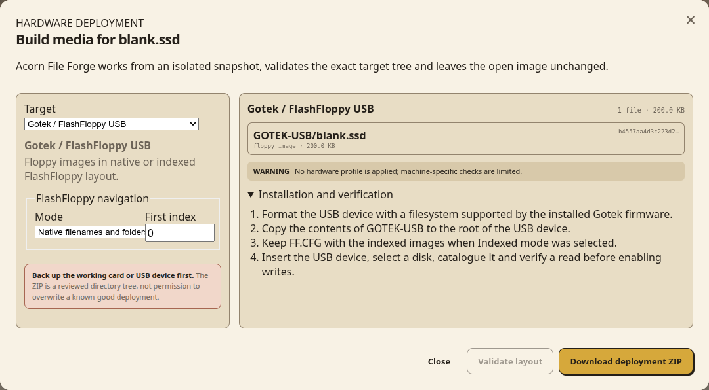

# Hardware deployment assistant

Acorn File Forge can turn an open image into a checked directory tree for a
Gotek, MMFS, BeebSCSI, Pi1MHz or RISC OS host. Open the image, apply the target
hardware profile, then choose **Tools → Build hardware deployment**.



The assistant is separate from **Save image**. Save creates the canonical
archive of the working image. Deployment creates a hardware-specific package
whose filenames and directories match the selected target. It never writes
directly to an SD card, USB device or physical disk.

## Safety model

Validation and packaging use a sparse private snapshot. A DAT image is
hardware-finalised, checked and hashed in that snapshot, so opening the
assistant does not advance the live ADFS disc ID, alter a directory sequence
or clear the pane's changed state. The reviewed source revision is recorded in
the plan. If the image changes before **Download deployment ZIP** is selected,
the server rejects the stale plan and requires another validation.

Every package contains:

- the exact target directory tree;
- `README.md`, generated from the chosen target and applied hardware profile;
- `Deployment/manifest.json`, with source revision, paths, sizes and SHA-256
  values;
- `Deployment/compatibility-report.md`, using the same compatibility schema as
  cross-format copies.

Blocking findings disable download. Warnings remain visible and are copied to
the package so a manual hardware requirement cannot be forgotten after the
browser closes.

## Target layouts

### Gotek and FlashFloppy

Supported floppy images can be packaged in Native mode, retaining useful
filenames, or Indexed mode. Indexed mode creates names beginning at the chosen
`DSKA0000` position and includes an `FF.CFG` which selects indexed navigation.
For an MMB, every formatted slot is exported as an individual DFS disk; empty
slots are not invented as floppy files. Copy the contents of `GOTEK-USB` to
the USB root.

The assistant does not generate `HXCSDFE.CFG`. That file contains physical
directory-order state maintained by the HxC selector workflow, and creating a
lookalike from filenames would not be safe.

### MMFS

An open MMB becomes `SD-CARD/BEEB.MMB`. Copy `BEEB.MMB` to the FAT root of a
working MMFS card. The profile check warns when no MMFS interface or build is
declared. PAGE, ROM and machine compatibility remain part of image and menu
audits, not something deployment silently changes.

### BeebSCSI

A matched DAT and DSC pair becomes:

```text
SD-CARD/
└── BeebSCSI0/
    ├── scsi0.dat
    └── scsi0.dsc
```

The disposable DAT copy is normalised to the DSC geometry, its old-ADFS
directory copies and map are checked, and both files are hashed before the ZIP
is enabled. Merge the `BeebSCSI0` directory into a backed-up card. Do not rename
one half of the pair or combine files from different saves.

### Pi1MHz

An MMB uses `SD-CARD/BEEB.MMB`. A BeebSCSI pair uses the `BeebSCSI0` layout
above. The package is a merge tree: preserve the working Pi firmware,
`Pi1MHz.cfg`, saved state and unrelated target directories already on the
card. Electron profiles are warned when they do not include AP5 or another
compatible 1 MHz bus route.

### RISC OS and Archimedes hosts

A supported FileCore image is placed below `RISC-OS-HOST/Images`. The assistant
can validate the image and its companion metadata, but it cannot infer the
geometry or controller configuration of every emulator, podule or storage
adapter. The generated README therefore marks attachment as a manual step.
Run the target filing-system checks before enabling application writes.

## Recommended workflow

1. Apply the exact hardware profile in **Workbench**.
2. Save or checkpoint important edits.
3. Choose **Tools → Build hardware deployment** and select the target.
4. For Gotek, choose Native or Indexed mode and the first index.
5. Select **Validate layout**. Review target paths, byte totals, SHA-256 values,
   profile warnings and installation steps.
6. Resolve blocking findings. Revalidate after changing either the image or
   target options.
7. Download the ZIP and extract it to a temporary host directory.
8. Back up the known-good physical medium, then merge the generated tree.
9. Perform the catalogue, read, write and reboot checks listed in its README.
10. Keep the previous medium unchanged until those checks pass.

## Cross-format preflight

Drag and drop, Cut/Copy/Paste, **File → Insert File**, folder import and Online
Library installation use the same versioned compatibility report before a
cross-format batch starts. The report shows each proposed target name, load and
execute metadata, directory loss, filetype loss, truncation and collisions.
Nothing is copied while that review is open. Online Library keeps the review
inside its search dialog and requires a second, explicitly reviewed Install
action.

JSON and Markdown exports are available from the full review dialog. The
manual **Analyse → Dry-run selected items** command remains useful when a
report is needed without starting a transfer.

## Limits

- Deployment does not format removable media or overwrite an attached device.
- RISC OS controller geometry remains a documented manual decision.
- Whole-MMB emulator mounting is still unavailable until a managed emulator
  exposes an MMFS-compatible virtual SD adapter.
- UEF reconstruction, unsupported HFE track layouts and ambiguous FileCore
  media retain their existing read-only or rejected behaviour.
