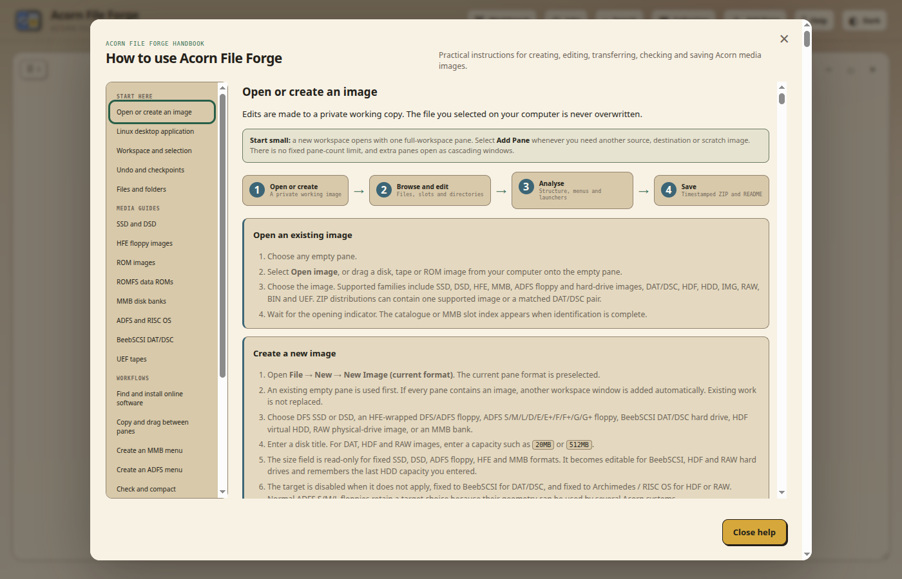
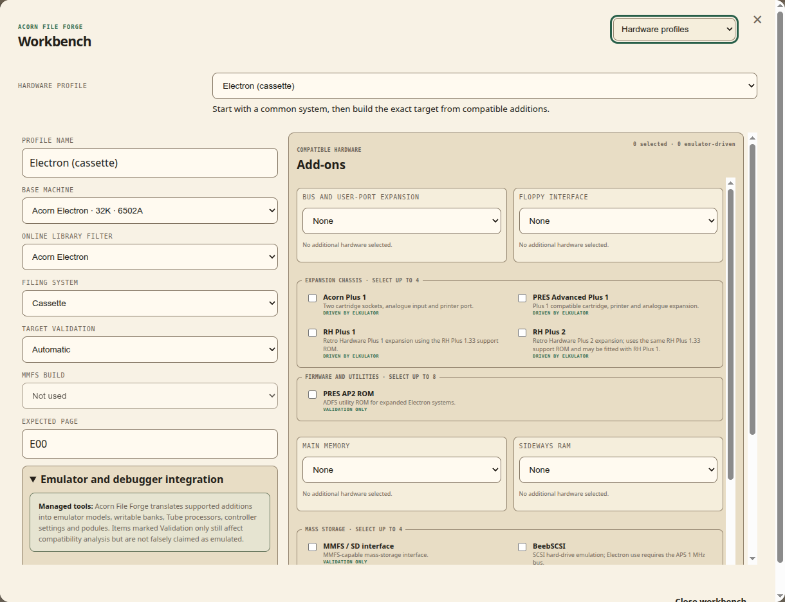

# Acorn File Forge documentation

This directory is the technical handbook for Acorn File Forge. Start with the
task you need to complete, then follow the linked guide for the details. The
in-app **Help** handbook covers the same workflows with controls and terminology
that match the running frontend.

## Choose a guide

| I want to... | Read this |
| --- | --- |
| Install, update, back up or troubleshoot the Docker service | [Installation and operations](INSTALLATION.md) |
| Install or develop the native Linux application | [Linux desktop application](LINUX-DESKTOP.md) |
| Write SSD, DSD, ADFS or HFE images to a real disk | [Greaseweazle physical floppy guide](PHYSICAL-FLOPPY-GUIDE.md) |
| Build a checked Gotek, MMFS, BeebSCSI, Pi1MHz or RISC OS media tree | [Hardware deployment assistant](HARDWARE-DEPLOYMENT-GUIDE.md) |
| Review the mandatory web and desktop parity rules | [Web and desktop platform contract](PLATFORM-CONTRACT.md) |
| Understand every supported media family and normal workflow | [Main project handbook](../README.md) |
| Edit BASIC, command files, machine code, archives or binary data | [File editor and code analysis](FILE-EDITOR-GUIDE.md) |
| Inspect, preserve or edit load and execution addresses | [Acorn file catalogue metadata](FILE-METADATA-GUIDE.md) |
| Inspect, compare, build, patch or program ROM and ROMFS images | [ROM image handbook](ROM-GUIDE.md) |
| Build and validate a release | [Release checklist](RELEASE-CHECKLIST.md) |
| Contribute code or documentation | [Contribution guide](../CONTRIBUTING.md) |
| Understand maintainership and project decisions | [Project governance](../GOVERNANCE.md) |
| Report a vulnerability | [Security policy](../SECURITY.md) |
| Check dependency, emulator and firmware licence boundaries | [Third-party notices](../THIRD_PARTY_NOTICES.md) |
| Ask for support or report conduct concerns | [Support](../SUPPORT.md) and [code of conduct](../CODE_OF_CONDUCT.md) |
| Review retained validation evidence | [Current AMD64 RC2 evidence](release-evidence/2026-08-17-amd64-rc2.md) |
| Review completed and outstanding product improvements | [Product backlog](BACKLOG.md) |
| Audit the emulator firmware shipped in the image | [Firmware notes](../firmware/README.md) |
| Review the Oaknut FileCore integration and format limits | [Oaknut FileCore support](OAKNUT-FILECORE-SUPPORT.md) |
| Automate creation, validation, imports, menus, comparison and patching | [Headless CLI and deterministic recipes](CLI-GUIDE.md) |
| Catalogue owned images and find cross-image duplicates or missing titles | [Private collection catalogue](COLLECTION-GUIDE.md) |
| Find possible lives, energy, timer or collision modifications in game code | [Cheat-candidate analysis](CHEAT-ANALYSIS-GUIDE.md) |
| Complete a task while the application is open | Select **Help** in the application header |

## Capability map

| Media or feature | Browse | Edit | Create | Transfer | Analyse and repair | Save package |
| --- | ---: | ---: | ---: | ---: | ---: | ---: |
| DFS SSD and DSD | Yes | Yes, including load/execute words | Yes | Files and complete images | Catalogue, access and capacity checks | Image, metadata and README |
| MMB banks | Yes, including empty slots | Yes | Yes | Slots, batches and open image panes | Duplicates, menus, PAGE, access and slot health | MMB and README |
| ADFS S, M, L, E and F floppy images | Yes, including directories | Yes, including load/execute words | Yes | Files, directories and images | Filesystem, map, launcher and compatibility checks | Image, metadata and README |
| BeebSCSI DAT and DSC | Yes, including deep trees | Yes, including load/execute words | Yes | Files, trees and extracted disks | Geometry, map, directory and installed-software checks | DAT, DSC and README |
| HDF, HDD, IMG, RAW and BIN FileCore media | Yes | Where the detected layout is writable | Selected layouts | Files and directories | Geometry, map and target-profile checks | Image and README |
| UEF tapes | Yes, as a decoded hierarchy | Same-length proven members | No | Extracted files into writable media | Physical chunks, reconstruction proof and structural comparison | Rebuilt source or converted media |
| HFE floppy images | Yes | Clean sector HFE v1 only | Yes | Files and images | Track and sector capability checks | HFE and README |
| ROM images | Banks, headers, commands and regions | Bytes, project data and supported structures | Yes | Banks and programmer files | Commands, help, code, data, checksums and compatibility | ROM, project JSON and README |
| ROMFS data ROMs | Files and directories | Yes | Yes | Files and directories | Structure and capacity checks | ROM, project JSON and README |
| ZIP and other supported archives | Yes, as a hierarchy | Extract, inspect and edit supported members | No | Members into writable media | Type and metadata inspection | Exported member or destination image |

The table is a navigation aid, not a replacement for format restrictions.
Acorn File Forge rejects geometry, track and filesystem variants it cannot
write safely. Read the warning shown by the application before converting or
repairing unusual media.

## Main workflows

### Work with several images

The workspace starts with one pane and has no fixed pane-count limit. Each pane
is a movable, resizable window with its own open image, current directory,
selection, progress, undo history and hardware profile. Panes can overlap,
snap to workspace sides or corners, minimise to the workspace shelf and restore
their layout after refresh. Dragging between panes
uses the same validation as Cut, Copy and Paste, including DFS name limits,
ADFS directory capacity, MMB slot rules and metadata conversion.

Cross-format drag, clipboard, File-menu and Online Library batches stop at a
shared compatibility review before the first write. The review records every
target-name conversion and metadata loss using the same exportable schema as
**Analyse → Dry-run selected items**.

### Edit files by content

Double-click a file to open the suitable editor. Tokenised BBC BASIC opens as
editable source, command files open as scripts, recognised machine code opens
as annotated disassembly, archives open as file hierarchies, and other binary
data opens in the hex editor. The editor includes search and replace, history,
safe save and save-as operations, local export, folding, language help, BASIC
formatting and guarded source transformations. See the
[editor handbook](FILE-EDITOR-GUIDE.md) for the exact save and byte-sync rules.

Open one BASIC or machine-code file and use **Tools → Find cheat candidates**
for a read-only gameplay-state report. It distinguishes strong,
likely and possible evidence, supports purpose filters and links to optional
online identification and specialist references. It does not patch uncertain
code. Proven machine-code changes can be saved as exact-hash guarded patches;
the browser-private library matches the complete file hash and original bytes,
then applies through an automatic checkpoint. Runtime observations remain
tester supplied until managed watchpoint correlation is complete. See the
[cheat analysis guide](CHEAT-ANALYSIS-GUIDE.md).

### Build and maintain menus

MMB and ADFS menu workflows discover existing records before consulting image
content, distribution filenames or online metadata. Menu entries can be kept
off-menu, cloned for multi-title disks, edited in bulk, reordered and audited.
Launch candidates are taken from the selected disk or directory, with SSDMENU,
!BOOT and conventional loader names handled according to their actual content.
PAGE values are derived from the selected launcher and changing one requires a
safety confirmation.

### Test against a hardware profile

The Workbench describes the base machine, filing system, compatible additions,
Tube state, memory, MMFS build and emulator choices. Analysis and help use that
profile when deciding whether a command, loader or image is appropriate. The
managed Elkulator, B-em and MAME tools provide launch and debugging paths for
the formats each emulator can genuinely mount.

Use **Tools → Build hardware deployment** to create a validated Gotek, MMFS,
BeebSCSI, Pi1MHz or RISC OS directory tree from the open image. The assistant
works on an isolated snapshot, shows exact paths and SHA-256 values, and writes
the installation, verification and rollback procedure into the downloaded
ZIP. See the [deployment guide](HARDWARE-DEPLOYMENT-GUIDE.md).

### Preserve and recover work

Browser-owned sessions are private working copies. Named checkpoints and undo
cover image changes, while workspace restoration reopens panes after an
ordinary refresh. Saving builds a timestamped ZIP only after the image and its
documentation are complete. Each package includes the image, partner and
metadata files where applicable, checksums, target details, warnings and a
generated README.

### Automate a repeatable build

The supported headless CLI exposes image creation, finalisation, validation,
manifest export, host-file import, UEF conversion, compaction, MMB and ADFS
menu creation, comparison and guarded patches. Mutating commands have a dry-run
mode with stable JSON status and exit codes. Completed commands can record a
versioned recipe containing exact source hashes and replayable non-secret
decisions. See the [CLI guide](CLI-GUIDE.md).

### Catalogue a collection

The header **Collection** command indexes complete manifests in browser-private
IndexedDB. It records user-supplied locations and machines, identifies exact
cross-image content and title variants, maintains a wanted-title list and marks
entries stale when an open image revision changes. Full database backup/import
and a smaller report export remain separate. See the
[collection guide](COLLECTION-GUIDE.md).

## Documentation conventions

- Write direct, factual prose. State the supported operation, its validation
  boundary and the observable failure mode. Do not imply support that has not
  been exercised.
- Use commas, colons, semicolons or separate sentences instead of em dashes.
- Distinguish implemented behaviour, retained test evidence and work that
  still requires hardware or architecture-specific validation.
- Menu paths use **File → Save image** style notation.
- Acorn paths use their native syntax, such as `$.Games.Repton` or `R.Loader`.
- Sizes use KiB, MiB and GiB when describing byte capacity.
- “Working image” means the private server-side copy, not the source selected
  from the local computer.
- “Save” updates the working image. “Export” downloads an individual file.
  “Save image” creates the timestamped download package.
- Screenshots are captured from the current Docker build and should be updated
  whenever the illustrated controls or workflow change materially.

## Keeping the handbook current

Documentation changes are part of feature work. A change is complete when:

1. The main README and the relevant specialist guide describe the behaviour.
2. The in-app handbook uses the same names and restrictions.
3. Configuration, environment variables, ports and persistence rules match the
   Docker files in the repository.
4. Local links and image references resolve.
5. Changed UI screenshots are captured from a clean current build.
6. The release checklist includes any new generated-media or manual test gate.
7. Documentation regression tests pass and the published prose contains no em
   dashes or obsolete pane-count claims.

Do not use files from `samples/` as published documentation assets. That
directory is intentionally excluded from Git, release archives and the Docker
build context.
